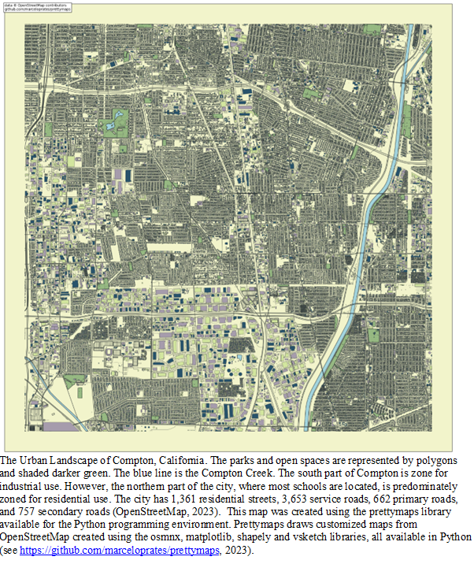

We are a multidisciplinary research group comprised of underrepresented scholars in the academy. Our work focuses on using geographic data science in social work policy and practice at the [Colleges of Social Work (https://cde.nus.edu.sg/arch/) and Public Health](https://cde.nus.edu.sg/arch/) at The [Ohio State University (OSU)](http://www.osu.edu), a leading global university based in Columbus, Ohio.

Our mission is to do applied work that impacts social policy by leveraging data and recent advances in spatial and statistical analysis.
We are particularly interested in the intersection of the social and physical environment and its impact on child and adolescent well-being broadly defined. This includes adverse childhood
experiences, child abuse and neglect, and other experiences of trauma.

Language is important. We no longer use terms that dehumanize individuals, families, and communities. This means that we do not refer to people as delinquents, we do not refer to households as dysfunctional, and we do not refer to communities as disorganized.

Our group follows the 4Cs philosophy that emphasizes culture, community, collaboration, and communication. Briefly, this means that we engage in thoughtful communication and collaboration that emphasizes
community as a critical source for social change. Click here to read more about our philosophy and practice.

Dr. Gia Elise Barboza-Salerno created the research group in 2023. Motivated primarily by a desire to effectuate systemic reform, particularly in child welfare, criminal justice and juvenile justice. You can read more about our research agenda [here](research). We are particularly interested in bringing urban analytics and geospatial analysis to examine the spatial distribution of victimization in urban areas. 

Below is a map we created for one of our most recent manuscripts that uses computational network analysis to understand firearm-related harm in Compton, California. View our github site to see how this map was made using the [`prettymaps`](https://github.com/marceloprates/prettymaps) package in python.

We are involved in several community-based and academic collaborations such as the [Ohio Policy Evaluation Network (OPEN)](https://open.osu.edu/) and the [Franklin County Public Defender](https://defender.franklincountyohio.gov/).

