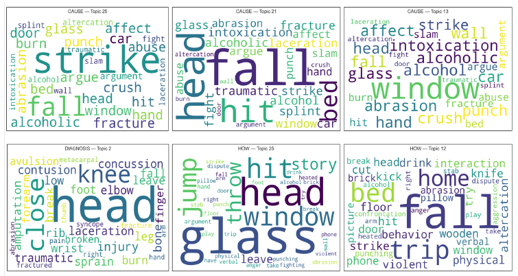

Dr. Gia Barboza-Salerno, Olivia McLucas, and Dr. Karla Shockley will present their research at the **2026 Symposium on Data Science & Statistics (SDSS)** in Milwaukee, Wisconsin.

## Presentation Details

**Title:** Automated Detection of Intimate Partner Violence Injury Mechanisms from Emergency Department Narratives Using Large Language Models and Latent Dirichlet Allocation

**Session:** AI and LLM Applications I  
**Date:** Tuesday, April 29, 2026  
**Time:** 3:45 - 5:15 PM CT  
**Format:** 25-minute refereed presentation  
**Location:** Milwaukee, Wisconsin

**Registration:** [Register for SDSS 2026](https://ww2.amstat.org/meetings/sdss/2026/)  
**Registration Deadline:** March 25, 2026

---

## Abstract

We developed an AI pipeline designed to overcome limitations in existing surveillance systems by distinguishing the underlying mechanisms of Traumatic Brain Injury (TBI) in intimate partner violence (IPV). The primary goal was to apply a Large Language Model (LLM) to extract and classify behavioral and contextual information from unstructured free-text narratives within the National Electronic Injury Surveillance System (NEISS).

The pipeline first cleans the narratives and uses the LLM to convert the text into six targeted structured semantic representations (e.g., action, cause, diagnosis), which are then quantified using Latent Dirichlet Allocation (LDA) topic modeling. Our results can be used to enhance injury surveillance to identify IPV in emergency department settings.

---

## Introduction

Head, face, and neck injuries are common IPV-related injuries and frequently involve TBI, yet NEISS diagnostic codes lack the behavioral detail needed to differentiate mechanisms of harm. Although NEISS narratives contain brief descriptions of arguments, aggression, object use, and environmental context, they have been underutilized in surveillance research and rarely analyzed at scale.

As a result, diagnostic codes collapse distinct injury pathways—including accidental falls, object impacts, impulsive actions during conflict, and direct assaults—into the same categories, obscuring meaningful variation in risk and limiting clinical screening and prevention efforts.

**Our method fills this gap** by applying AI-based extraction and topic modeling to detect behavioral and situational information embedded in NEISS narratives, producing a more nuanced understanding of IPV-related injury mechanisms.

---

## Methods

### Analytical Framework

We developed an AI pipeline to extract and classify behavioral and contextual information from unstructured NEISS narratives related to IPV:

1. **Text Preprocessing**: Used regular expressions to flag domestic-violence–related incidents, expand abbreviations, clean shorthand, and isolate IPV cases
2. **Custom Prompting**: Generated prompts by merging cleaned narratives with structured NEISS variables
3. **LLM Extraction**: Transformed narratives into six semantic fields (action, cause, diagnosis, mechanism, object, location)
4. **Topic Modeling**: Applied LDA to identify latent themes within each semantic field
5. **Typology Classification**: Integrated regex-based typology and LDA clusters to produce quantitative injury pathways

### Text Processing and Prompting

We used vectorized regular expressions to:

- Flag violence-related narratives
- Expand abbreviations and clean shorthand
- Isolate IPV cases by identifying relationship and conflict terms
- Exclude clearly non-IPV incidents

After preprocessing, we generated custom prompts by merging each cleaned narrative with structured NEISS variables to produce context-rich descriptions of the event.

### LLM Extraction and Topic Modeling

The LLM transformed cleaned narratives into **six structured semantic representations**:

- **Action**: What happened (e.g., verbal disputes, punching, striking objects)
- **Cause**: Why it happened (e.g., intoxication, falls, collisions)
- **Diagnosis**: Medical outcome (e.g., fractures, contusions, lacerations)
- **How**: Mechanism of injury (e.g., physical struggle, impulsive acts)
- **What**: Objects involved (e.g., walls, windows, doors, fists)
- **Where**: Location (e.g., home, public place, bathroom)

LDA topic modeling systematically discovered and quantified overarching themes across all responses, resulting in quantifiable dimensions like interpersonal conflict or blunt impact injuries.

---

## Data & Results

### Quantification of Contextual Dimensions (LDA Topics)

Topic modeling produced interpretable themes across all semantic dimensions:

- **Action**: verbal disputes, play fighting, punching, striking objects
- **Cause**: intoxication, falls, collisions with walls, windows, or furniture
- **Diagnosis**: fractures, contusions, lacerations, closed head injury
- **How**: physical struggle, impulsive acts, heated altercations
- **What**: walls, windows, doors, bricks, glass, fists
- **Where**: home, public place, outside environment, bathrooms

### Identified Head/Neck Injury Typologies

Narrative- and topic-derived clusters aligned with six major typologies:

| Typology | % | Representative Narrative |
|----------|---|--------------------------|
| Accidental fall or slip | 38.6% | "Slipped and fell hitting head on carpet." |
| Self-inflicted harm | 19.9% | "Banging head against wall during argument." |
| Physical assault | 25.1% | "Stabbed in neck with kitchen knife." |
| Blunt object impact | 9.9% | "Head-butted wall; forehead hematoma." |
| Environmental | 2.3% | "Pepper spray during fight." |
| Vehicle-related impact | 1.7% | "Swerved and crashed; head/neck pain." |

### Word Cloud Visualization

The figure above shows word-cloud representations of dominant latent topics extracted from LLM-generated semantic dimensions (Cause, Diagnosis, How). Each cloud visualizes high-frequency terms within a topic cluster, highlighting recurrent mechanisms of injury across IPV-related emergency department visits.

**Key patterns identified:**

- Heavy concentration of head trauma in incidents involving walls, floors, or doors
- High rates of head contact in intoxication-related falls
- Frequent head or neck injury during impulsive self-directed actions

---

## Discussion & Conclusions

Combining regex-based classification with LLM extraction and LDA provides a **detailed mapping of how, where, and why brain injuries occur** during IPV-related incidents.

### Key Findings

1. **Blurred Boundaries**: Many injuries categorized as "accidental" or "environmental" occur in the context of relationship conflict, revealing blurred boundaries between unintentional and interpersonal harm

2. **Enhanced Surveillance**: These methods improve surveillance and detection of IPV-related injuries in emergency departments by recovering behavioral information that structured diagnostic codes cannot capture

3. **Mechanism Identification**: The narrative-based approach identifies specific mechanisms that contribute to injury, whereas structured codes often make it difficult to distinguish between distinct behavioral pathways

### Future Work

- Expanding prompts to capture richer contextual cues
- Validating typologies with larger datasets
- Examining variation across sociodemographic and clinical subgroups

---

## About SDSS

The Symposium on Data Science & Statistics is a premier conference bringing together researchers, practitioners, and students working at the intersection of statistics, data science, and computational methods. The 2026 symposium takes place April 28 - May 1 in Milwaukee, Wisconsin.

---

**Keywords**: Traumatic brain injury, intimate partner violence, surveillance, Natural Language Processing, topic modeling, emergency medicine, LLM, LDA
