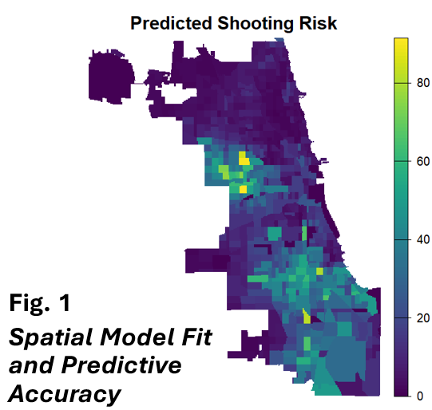

## Presentation at Women in Statistics and Data Science Conference

Our presentation, *Modeling Firearm Injury Risk Using Spatial Random Forests*, was delivered by Dr. Gia Barboza-Salerno at the Women in Statistics and Data Science on November 12, 2025 in Cincinnati, OH.

## Abstract

This research develops and validates a **spatial random forest prediction model** for firearm-related injury risk at the census tract level in Chicago. By incorporating spatial autocorrelation and neighborhood-level predictors, the model achieves high predictive accuracy in identifying areas at elevated risk for gun violence.

## Methodology

### Spatial Random Forest Approach

The spatial random forest model extends traditional random forest methods by:

1. **Capturing Non-Linear Relationships**: Modeling complex interactions between neighborhood characteristics and shooting risk
2. **Handling Spatial Autocorrelation**: Incorporating spatial structure through lag variables
3. **Variable Importance**: Identifying which neighborhood features are most predictive
4. **Robust Predictions**: Providing out-of-sample risk estimates

### Data Sources

- Shooting incident data from Chicago
- Census tract-level socioeconomic indicators
- Built environment features
- Spatial lag variables to capture spillover effects

### Model Validation

- Cross-validation for predictive performance assessment
- Spatial autocorrelation diagnostics
- Comparison with traditional regression approaches

## Key Findings

The predicted shooting risk map (shown above) demonstrates:

- **High Spatial Variation**: Risk scores range from 0 to over 80 predicted incidents
- **Concentrated Risk**: Certain neighborhoods show elevated firearm violence risk
- **Model Accuracy**: Spatial random forest successfully captures fine-grained risk patterns
- **Spatial Clustering**: Violence risk exhibits significant spatial autocorrelation

## Applications

This spatial prediction model has important applications for:

1. **Resource Allocation**: Targeting violence prevention resources to high-risk areas
2. **Prevention Planning**: Understanding neighborhood-level drivers of gun violence
3. **Policy Evaluation**: Assessing how neighborhood changes affect violence risk
4. **Early Warning**: Detecting emerging hotspots before violence escalates

## Implications

The research demonstrates that spatial random forest models can:

- Improve prediction of firearm violence risk beyond traditional methods
- Identify actionable neighborhood-level intervention targets
- Account for complex spatial dependencies in violence patterns
- Support evidence-based violence prevention strategies

---

**Conference**: Women in Statistics and Data Science Conference  
**Location**: Cincinnati, Ohio  
**Date**: October 1-3, 2025  
**Authors**: Gia Barboza-Salerno, Hexin Yang, Taylor Harrington
