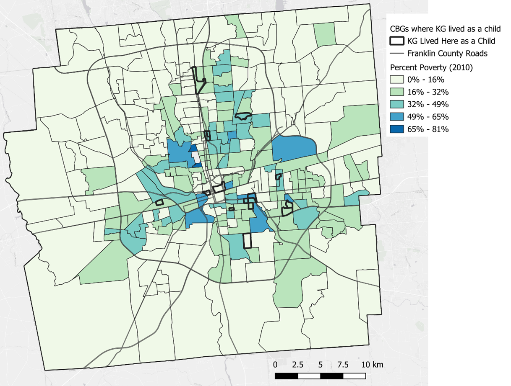

+++
widget = "blank"
headless = false  # This file represents a page section.

title= "Social Geography of Child Adversity"
subtitle = "Supporting Public Defense with Data-Driven Insights"
summary = "We examine how childhood adversity and neighborhood conditions shape criminal legal system involvement."

[design]
  columns = "1"
+++

We are collaborating with the public defender's office to integrate geospatial and socio-legal research into legal defense strategies. Our work aims to contextualize clients' life histories using evidence-based indicators of childhood adversity, systemic deprivation, and community-level disinvestment.

# In progress

## Geographies of Risk and Resilience

| | |
| ------------------| -------------------------------------------------- |
| Short description: | Mapping the spatial distribution of child adversity to inform contextual defense. |
| Lead developer: | {} |
| Partners: | Office of the Public Defender, Legal Aid, Community Organizations |
| Data sources: | ACS, Opportunity Atlas, Child Opportunity Index, CRDT fatality reviews |
| Methods: | Bayesian spatial modeling, risk typologies, qualitative interviews |
| Geographic focus: | Urban and rural counties across the Midwest |
| Objectives: | Illuminate how systemic inequality shapes pathways to legal system involvement |

We are also exploring how these data can be presented during mitigation to underscore the role of systemic harms in shaping client trajectories.

## Conference Presentation

I will be speaking at the upcoming **Death Penalty Defense seminar**, hosted by the Ohio State Bar Association, taking place as part of their 2025 CLE Live Seminars.

> **Enhance your expertise in capital defense at our annual program, designed exclusively for criminal defense attorneys.** Over two dynamic days, engage in in-depth discussions and gain valuable insights into key considerations when handling capital cases. Don’t miss this opportunity to elevate your practice with expert-led presentations and interactive sessions.

This seminar offers:
- **12.0 hours** of training on the defense of capital cases, fulfilling requirements set by the Commission on Appointment of Counsel in Capital Cases
- **6.0 hours** of training on the appeal of capital cases (for those who attend both days)

My presentation will focus on integrating social science into criminal legal defense—specifically, how geospatial models of child adversity can be mobilized to inform capital mitigation, challenge systemic bias, and support holistic defense strategies.

For related work, visit our [Pregnancy Justice](/lab/preg-just) page or explore our [Spatial Accessibility tutorial](/lab/markdown/spatialaccess.html).