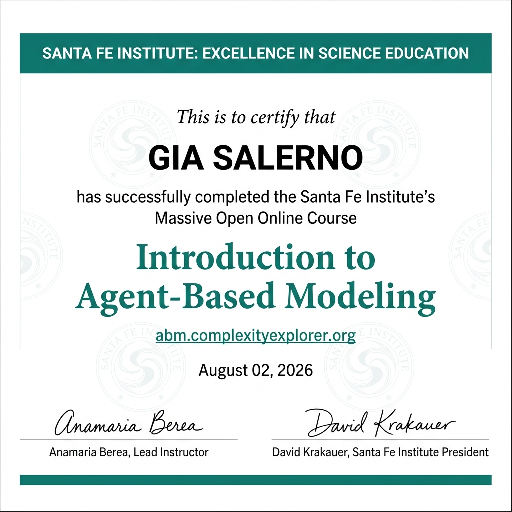

We are proud to announce that **Keith Warren** and **Gia Barboza-Salerno** have successfully completed the **Santa Fe Institute's Introduction to Agent-Based Modeling** certificate course through [abm.complexityexplorer.org](https://abm.complexityexplorer.org)! 🎓

Agent-Based Modeling is a powerful computational method for simulating the actions and interactions of autonomous agents including individuals, households, and organizations in order to understand how macro-level patterns emerge from micro-level behaviors. ABM is particularly well-suited for studying complex social systems such as neighborhood dynamics, health behavior spread, child welfare intervention cascades, and community-level resilience.

The addition of ABM to the ISSUES Lab's methodological toolkit opens exciting new avenues for our research on structural inequality, environmental justice, and social determinants of health.

Congratulations to Keith and Gia on this outstanding achievement! We look forward to seeing how these new computational skills enrich the lab's work.
