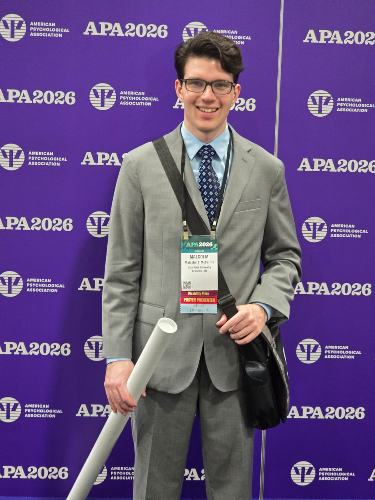
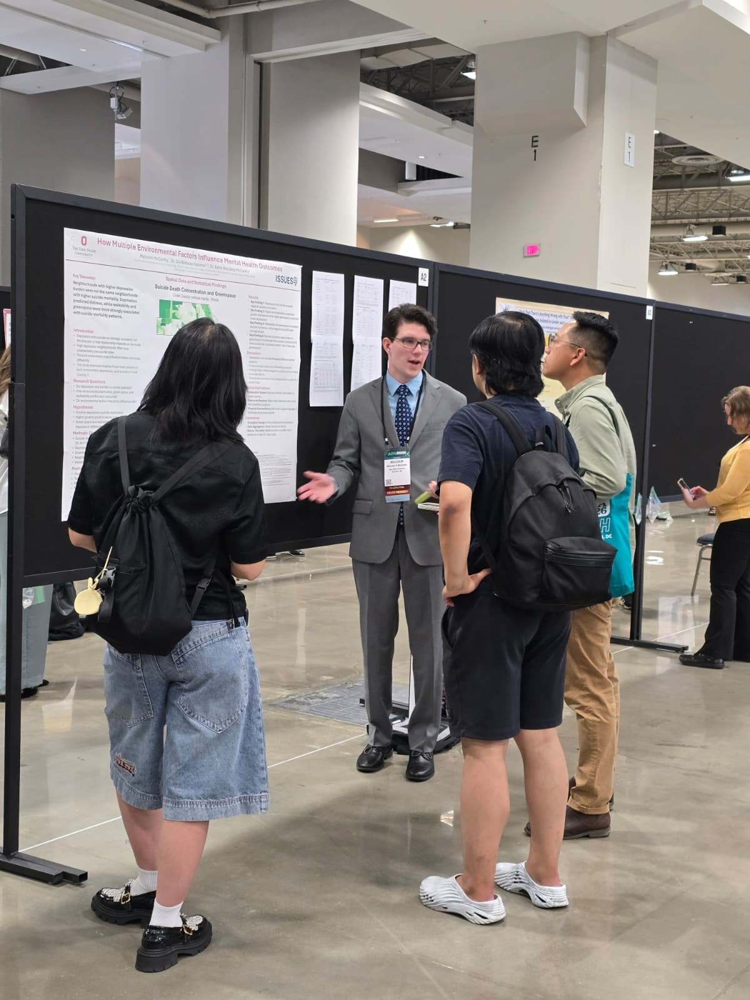
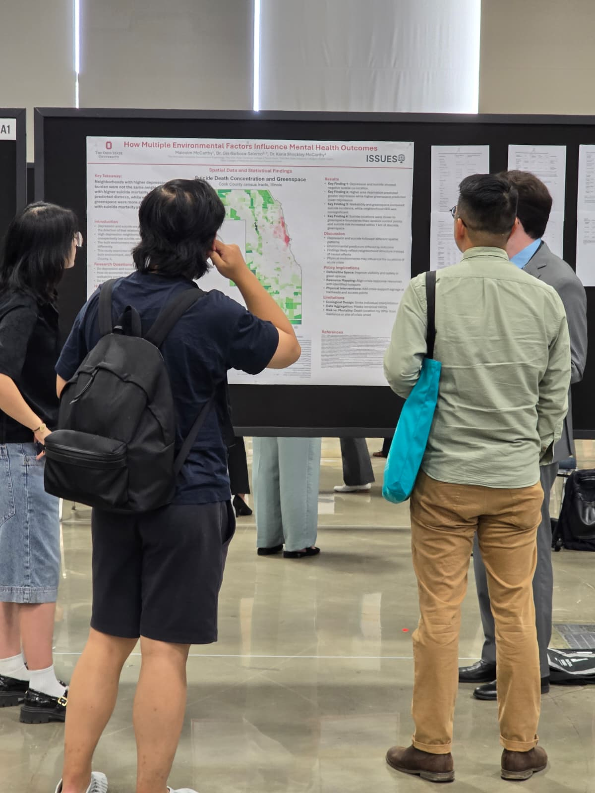
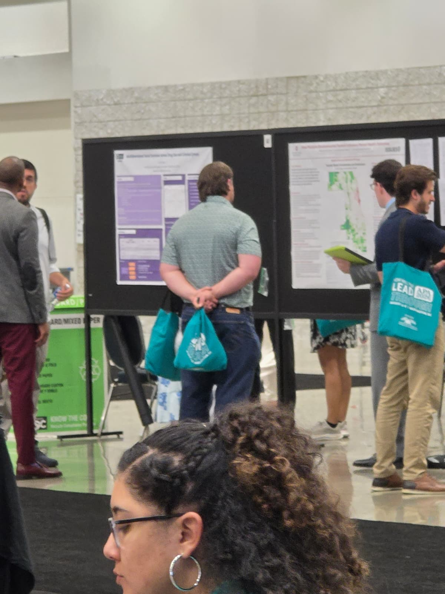

We are thrilled to congratulate **Malcolm McCarthy**, an undergraduate psychology student in the ISSUES Lab, for presenting his **first-authored research poster** at the [American Psychological Association (APA) 2026 Annual Convention](https://www.apa.org/convention), held August 6–8, 2026 at the Walter E. Washington Convention Center in Washington, DC!

Malcolm's poster, titled:

> **"How Multiple Environmental Factors Influence Mental Health Outcomes"**

explores how neighborhood-level environmental conditions—including greenspace exposure and suicide death concentrations—shape mental health and suicide risk across census tracts in Cook County, Illinois. The study integrates spatial data and statistical modeling to disentangle the complex relationships between depression burden, environmental predictors, and suicide mortality.

### Key Findings

- Neighborhoods with higher depression burden were not the same neighborhoods with higher suicide mortality, highlighting that these are distinct spatial phenomena.
- Higher greenspace predicted greater depression while also being associated with reduced suicide incidence.
- Walkability and greenspace together influenced the co-location of depression and suicidality.
- Suicide locations were closer to greenspace boundaries than random control points, and suicide risk increased within 1 km of nearby greenspace.

### Policy Implications

The research points to actionable environmental design strategies such as accessible greenspace, improved walkability, and targeted community support services as levers for reducing mental health disparities in urban areas.

Co-authored with Dr. Gia Barboza-Salerno and Dr. Karla Shockley-McCarthy, Malcolm's presentation was part of the Society for the Psychological Study of Social Issues (SPSSI) poster session (Division 9).

  
  
  
  

📄 **[Download the Poster](/uploads/APA%202026%20Poster.pptx)**

This is an outstanding achievement for an undergraduate researcher. Malcolm's presentation reflects the caliber of work being done in the ISSUES Lab and his dedication to evidence-based science in service of community wellbeing. We are incredibly proud of you, Malcolm! 🎉
