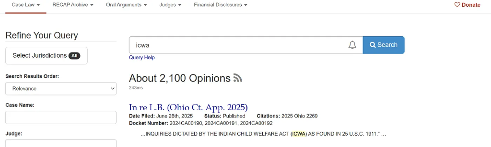
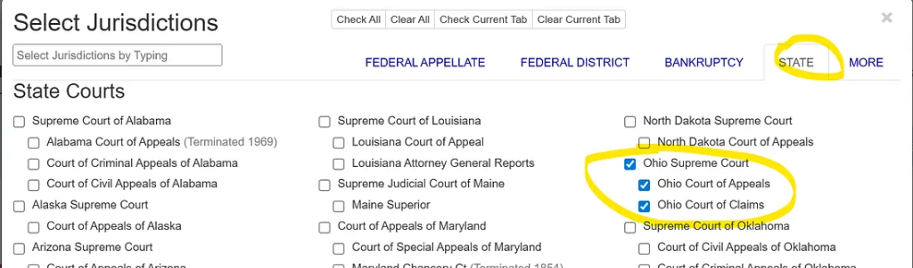
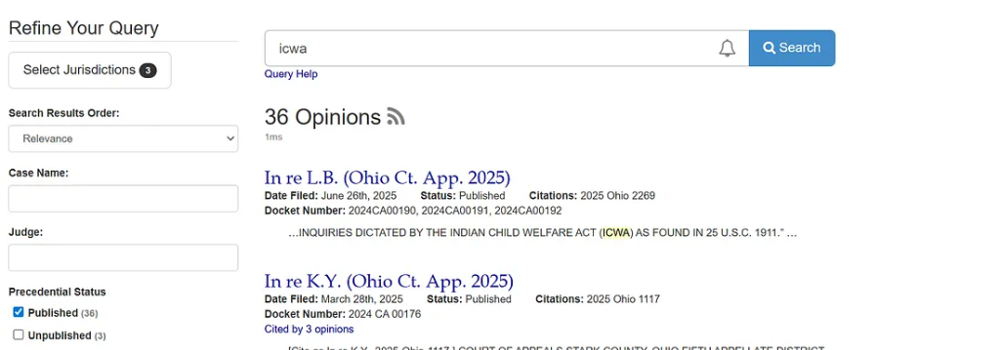
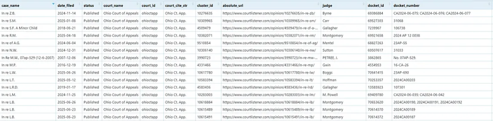
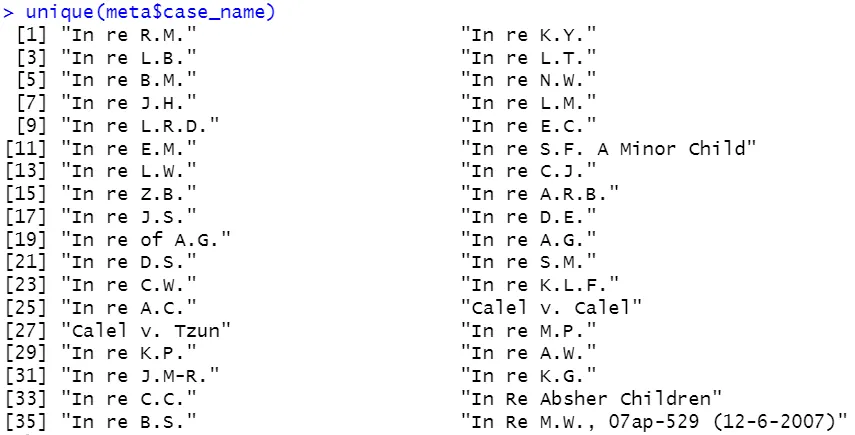
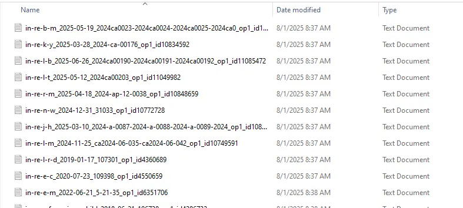
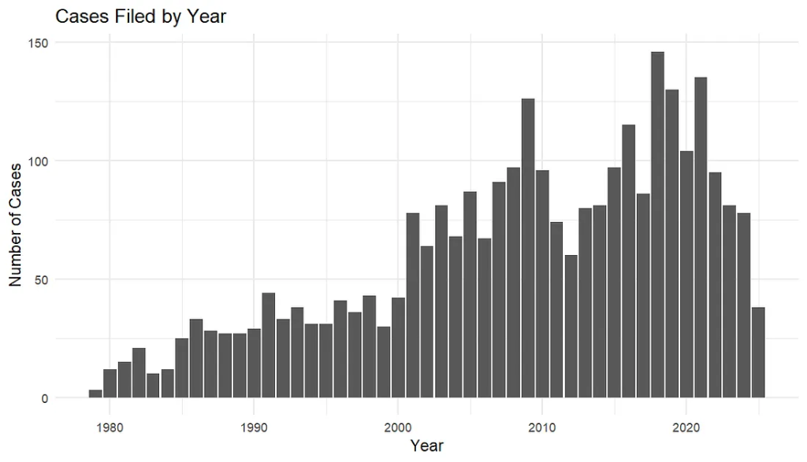
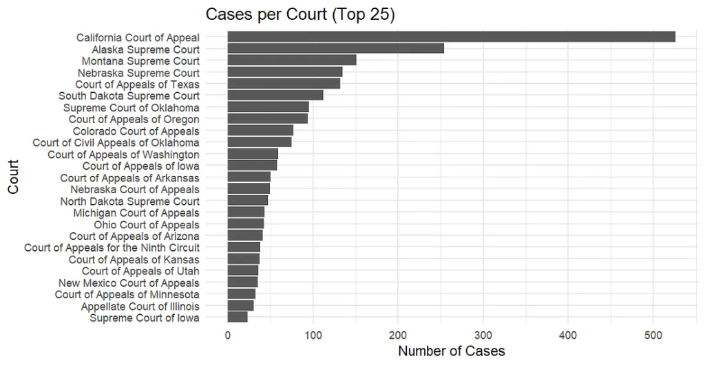

I previously showed how to pull Indian Child Welfare Act (ICWA) cases using the Caselaw Access Project (Harvard Law). That API has since changed. This post updates the workflow using the Free Law Project's [CourtListener](https://www.courtlistener.com/), which now partners with Harvard to make this data freely available.

---

## Finding the Cases

Start at the [CourtListener website](https://www.courtlistener.com/) and search for **"Indian Child Welfare Act"** (or `"icwa"`). You'll see a page of opinion results.



Click **Select Jurisdiction → State**. Clear all, then select **Ohio Supreme Court**, **Ohio Court of Appeals**, and **Ohio Court of Claims**. This gives you a quick check on the expected volume to validate the code's output below.



The site reported **36 cases** from Ohio. Note that the exact number may change over time as new opinions are added or metadata is corrected.



---

## Getting the Data into R

The Search API returns clean JSON results by querying for opinions that contain the exact phrase `"indian child welfare act"`, restricting to published opinions, ordering by relevance, and (optionally) limiting results to three Ohio courts.

```r
library(httr2)
library(purrr)
library(dplyr)
library(tibble)
library(tidyr)
library(stringr)

SEARCH_BASE <- "https://www.courtlistener.com/api/rest/v4/search/"
UA <- "R/httr2 (your-email-address) – ICWA metadata collection"

query_params <- list(
  q             = '"indian child welfare act"',
  type          = "o",
  order_by      = "score desc",
  stat_Published = "on",
  court         = "ohio ohioctapp ohioctcl"  # optional: specify court
)
```

A few helper functions keep the parsing tidy:

```r
pull_chr <- function(x, ...) {
  v <- purrr::pluck(x, ..., .default = NA)
  if (is.null(v) || length(v) == 0) return(NA_character_)
  as.character(v)
}

pull_num <- function(x, ...) {
  v <- purrr::pluck(x, ..., .default = NA_real_)
  suppressWarnings(as.numeric(v))
}

get_json <- function(url) {
  resp <- request(url) |> req_user_agent(UA) |> req_url_query() |> req_perform()
  resp_check_status(resp)
  resp_body_json(resp, simplifyVector = FALSE)
}
```

This function handles pagination automatically, following the `next` cursor until all pages are exhausted:

```r
fetch_search_pages <- function() {
  req <- request(SEARCH_BASE) |>
    req_user_agent(UA) |>
    req_url_query(!!!query_params)

  dat   <- req |> req_perform() |>
    (\(r){ resp_check_status(r); resp_body_json(r, simplifyVector = FALSE) })()
  pages <- list(dat)

  while (!is.null(dat$`next`)) {
    dat <- request(dat$`next`) |> req_user_agent(UA) |> req_perform() |>
      (\(r){ resp_check_status(r); resp_body_json(r, simplifyVector = FALSE) })()
    pages <- append(pages, list(dat))
  }
  pages
}

pages   <- fetch_search_pages()
results <- pages |> map("results") |> flatten()
```

`results` is a list of per-case records from the API. Each element includes the case name, filing date, court identifiers, citation strings, a public URL where the caselaw text is available, and other metadata.



For Ohio, this produced ~35 unique case names versus 36 displayed on the site. Minor discrepancies happen because search hits can include multiple opinions or sibling opinions per matter, and because the index is updated over time.



---

## Downloading the Full Text

Each opinion has an API endpoint with plain-text and HTML fields. A small loop can request the text for each case URL, with a short pause and retry between requests, and save one `.txt` file per opinion:

```r
download_opinion_text <- function(url, out_dir = "opinions") {
  dir.create(out_dir, showWarnings = FALSE)
  slug <- basename(url)
  path <- file.path(out_dir, paste0(slug, ".txt"))

  resp <- request(url) |> req_user_agent(UA) |> req_perform()
  resp_check_status(resp)
  body <- resp_body_json(resp, simplifyVector = FALSE)

  text <- body$plain_text %||% body$html_with_citations %||% ""
  writeLines(text, path)
  Sys.sleep(0.5)   # be considerate of rate limits
  invisible(path)
}

walk(map_chr(results, "absolute_url"), download_opinion_text)
```

Here are the Ohio ICWA cases downloaded to a local folder:



---

## Visualizing the Results

You can use `ggplot2` to visualize the results. Below are two examples: filings by year and volume by court.





---

## What You Can Do Next

After downloading all data — including caselaw text and metadata — you can:

- **Natural Language Processing** — examine sentiment or common words across opinions
- **Topic Modeling** — explore latent themes in ICWA cases using LDA or STM
- **Map filings by jurisdiction** — visualize geographic patterns of ICWA litigation
- **Integrate with other sources** — link to child welfare administrative data or Census indicators

> Remember to be considerate of rate limits and to include a **User Agent string** with your contact information in every request.

The complete workflow is available on my [GitHub](https://github.com/).

**Happy Coding!**
