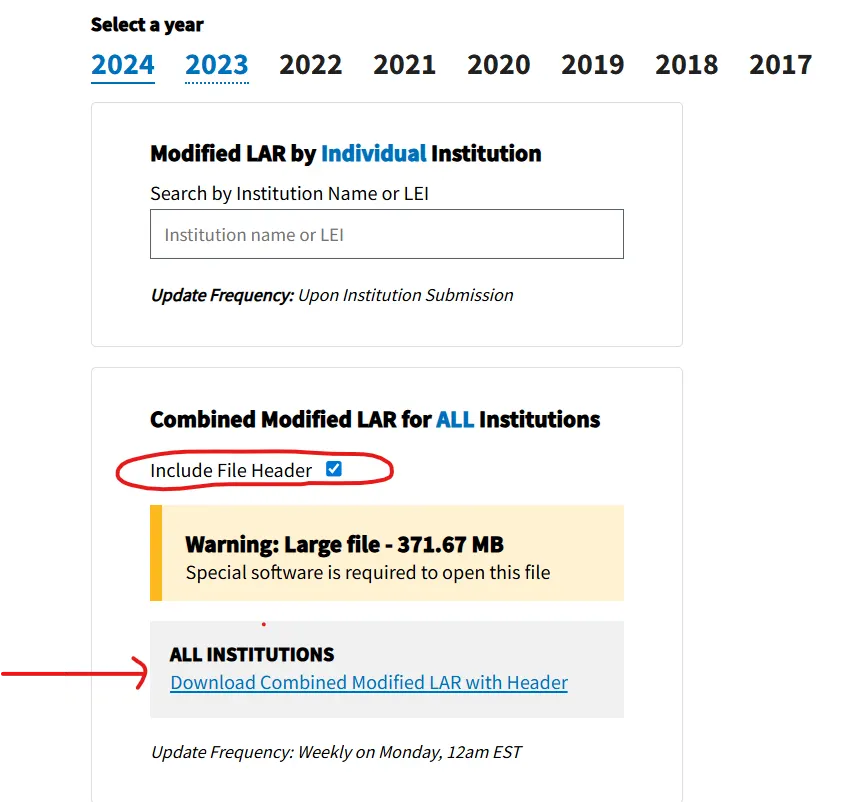
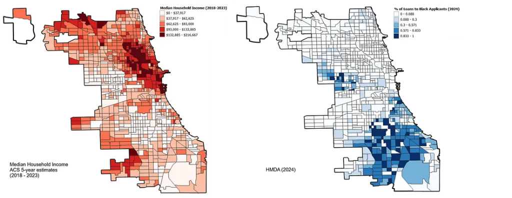

My lab recently published a paper examining the association between redlining, reinvestment, racial segregation, and firearm-related injury in Chicago, Illinois. You can read the paper here: [Redlining, reinvestment, and racial segregation: a Bayesian spatial analysis of mortgage lending trajectories and firearm-related violence](https://doi.org/10.1007/s11524-023-00770-7).

To develop reverse redlining measures, we relied on data from the **Home Mortgage Disclosure Act (HMDA)**.

If you're interested in patterns of lending discrimination, the HMDA dataset is an invaluable resource. It contains millions of individual loan application records submitted annually by financial institutions, making it one of the most extensive and detailed public data sources on mortgage lending in the United States. The 2024 nationwide Modified Loan/Application Register (LAR) alone contains over **12 million records** and **85 fields** that detail applicant and co-applicant demographics, loan terms, and property characteristics — including race, income, loan amount, interest rate, property value, and loan outcomes.

Each record includes the **census tract** of the loan origination, which allows researchers to situate applicants within their geographic context. This spatial identifier can be linked to other data sources (e.g., Census or ACS data), enabling robust analyses of racial disparities in lending, neighborhood-level disinvestment, and broader patterns of residential inequality.

> I highly recommend *The Color of Law* by Richard Rothstein for anyone interested in the deep-rooted history of discriminatory housing practices in the United States. The book compellingly explains how federal, state, and local policies intentionally created and reinforced de jure segregation. Chicago, one of the most highly segregated urban areas in the country, is prominently featured.

Due to its sheer volume, the HMDA data is not well-suited for analysis using spreadsheets like Excel — particularly when analyzing multiple years or conducting joins. Instead, its relational structure lends itself to **PostgreSQL**, an open-source relational database management system (RDBMS) that enables efficient querying, filtering, and aggregation of large datasets. PostgreSQL also supports the **PostGIS** geospatial extension, enabling direct spatial querying and linking to geographic units such as census tracts or ZIP codes. [Download PostgreSQL](https://www.postgresql.org/download/) if you don't already have it.

---

## Step 1: Download the Dataset

The dataset is freely available to the public.

1. Navigate to [https://ffiec.cfpb.gov/data-publication/modified-lar/2024](https://ffiec.cfpb.gov/data-publication/modified-lar/2024)
2. Choose **Year: 2024** → **Nationwide: Combined file**
3. Check **Include File Header**, then click **Download Combined Modified LAR with Header**



4. Save or extract the file to: `C:\Users\YOUR_USER_NAME\Downloads\2024_combined_mlar_header\`

---

## Step 2: Confirm the File Structure in PowerShell

The file is a **pipe-delimited `.txt` file** — it can be tricky to read in spreadsheet tools. Use Windows PowerShell to inspect the structure first:

```powershell
cd "C:\Users\YOUR_USER_NAME\Downloads\2024_combined_mlar_header"

# View the header (column names)
Get-Content .\2024_combined_mlar_header.txt -TotalCount 1

# Count the number of columns (should be 85)
((Get-Content .\2024_combined_mlar_header.txt -TotalCount 1) -split '\|').Count
```

---

## Step 3: Create the PostgreSQL Table

Launch your SQL interface (pgAdmin Query Tool or `psql`):

```bash
psql -U your_username -d your_database_name
```

Then define the 85-column table structure:

```sql
DROP TABLE IF EXISTS lar2024;
CREATE TABLE lar2024 (
  activity_year                              INTEGER,
  lei                                        TEXT,
  loan_type                                  INTEGER,
  loan_purpose                               INTEGER,
  preapproval                                INTEGER,
  construction_method                        INTEGER,
  occupancy_type                             INTEGER,
  loan_amount                                BIGINT,
  action_taken                               INTEGER,
  state_code                                 TEXT,
  county_code                                TEXT,
  census_tract                               TEXT,
  applicant_ethnicity_1                      INTEGER,
  applicant_ethnicity_2                      TEXT,
  applicant_ethnicity_3                      TEXT,
  applicant_ethnicity_4                      TEXT,
  applicant_ethnicity_5                      TEXT,
  co_applicant_ethnicity_1                   INTEGER,
  co_applicant_ethnicity_2                   TEXT,
  co_applicant_ethnicity_3                   TEXT,
  co_applicant_ethnicity_4                   TEXT,
  co_applicant_ethnicity_5                   TEXT,
  applicant_ethnicity_observed               INTEGER,
  co_applicant_ethnicity_observed            INTEGER,
  applicant_race_1                           INTEGER,
  applicant_race_2                           TEXT,
  applicant_race_3                           TEXT,
  applicant_race_4                           TEXT,
  applicant_race_5                           TEXT,
  co_applicant_race_1                        INTEGER,
  co_applicant_race_2                        TEXT,
  co_applicant_race_3                        TEXT,
  co_applicant_race_4                        TEXT,
  co_applicant_race_5                        TEXT,
  applicant_race_observed                    INTEGER,
  co_applicant_race_observed                 INTEGER,
  applicant_sex                              INTEGER,
  co_applicant_sex                           INTEGER,
  applicant_sex_observed                     INTEGER,
  co_applicant_sex_observed                  INTEGER,
  applicant_age                              TEXT,
  applicant_age_above_62                     TEXT,
  co_applicant_age                           TEXT,
  co_applicant_age_above_62                  TEXT,
  income                                     TEXT,
  purchaser_type                             INTEGER,
  rate_spread                                TEXT,
  hoepa_status                               INTEGER,
  lien_status                                INTEGER,
  applicant_credit_scoring_model             INTEGER,
  co_applicant_credit_scoring_model          INTEGER,
  denial_reason_1                            TEXT,
  denial_reason_2                            TEXT,
  denial_reason_3                            TEXT,
  denial_reason_4                            TEXT,
  total_loan_costs                           TEXT,
  total_points_and_fees                      TEXT,
  origination_charges                        TEXT,
  discount_points                            TEXT,
  lender_credits                             TEXT,
  interest_rate                              TEXT,
  prepayment_penalty_term                    TEXT,
  debt_to_income_ratio                       TEXT,
  combined_loan_to_value_ratio               TEXT,
  loan_term                                  TEXT,
  intro_rate_period                          TEXT,
  balloon_payment                            INTEGER,
  interest_only_payment                      INTEGER,
  negative_amortization                      INTEGER,
  other_non_amortizing_features              INTEGER,
  property_value                             TEXT,
  manufactured_home_secured_property_type    INTEGER,
  manufactured_home_land_property_interest   INTEGER,
  total_units                                TEXT,
  multifamily_affordable_units               TEXT,
  submission_of_application                  INTEGER,
  initially_payable_to_institution           INTEGER,
  aus_1                                      INTEGER,
  aus_2                                      TEXT,
  aus_3                                      TEXT,
  aus_4                                      TEXT,
  aus_5                                      TEXT,
  reverse_mortgage                           INTEGER,
  open_end_line_of_credit                    INTEGER,
  business_or_commercial_purpose             INTEGER
);
```

---

## Step 4: Import the Data

In `psql`, use the following single-line import command:

```sql
\copy lar2024 FROM 'C:/Users/YOUR-USER-NAME/Downloads/2024_combined_mlar_header/2024_combined_mlar_header.txt' WITH (FORMAT csv, DELIMITER '|', HEADER true, NULL '');
```

This tells PostgreSQL to:
- Read a pipe-delimited file
- Use the header row to match columns
- Treat empty strings as `NULL`

> **Note:** This must be entered as a **single line**. You will get a confirmation message when the data import succeeds.

---

## Step 5: Verify the Import

The official CFPB download page indicates that the 2024 nationwide file contains approximately **12 million rows**. After importing, verify with:

```sql
SELECT COUNT(*) FROM lar2024;
SELECT * FROM lar2024 LIMIT 5;
```

If the row count is substantially less than 12 million, the import did not complete successfully.

---

## Create the Chicago, Illinois Subset

With the full dataset loaded, you can create a focused subset with a `CREATE TABLE AS SELECT` statement. The query below selects **conventional, owner-occupied, site-built single-family loans** in Cook County (FIPS `17031`), excluding missing or exempt values:

```sql
DROP TABLE IF EXISTS public.il2024f1;
CREATE TABLE public.il2024f1 AS
SELECT
  l.activity_year,
  l.state_code,
  l.county_code,
  l.census_tract,
  l.debt_to_income_ratio,
  l.combined_loan_to_value_ratio,
  l.income,
  l.property_value,
  l.loan_amount,
  l.interest_rate,
  l.applicant_ethnicity_1,
  l.applicant_race_1,
  l.denial_reason_1,
  l.rate_spread,
  l.hoepa_status,
  l.lien_status
FROM public.lar2024 l
WHERE
  l.loan_purpose    = '1'          -- Home purchase
  AND l.action_taken   = '1'       -- Loan originated
  AND l.loan_type      = '1'       -- Conventional
  AND l.occupancy_type = '1'       -- Owner-occupied
  AND l.state_code     = 'IL'
  AND l.county_code    = '17031'   -- Cook County
  AND l.property_value ~ '^[0-9]+$'
  AND l.income         ~ '^[0-9]+$'
  AND l.loan_amount IS NOT NULL
  AND l.loan_amount <> 99999
  AND l.construction_method = '1'  -- Site-built
  AND l.total_units IN ('1','2','3','4','');
```

---

## Prepare for Additional Analysis

Once exported to CSV, I divided the number of Black applicants in each census tract by the total number of applicants in that tract to get the **share of Black applicants**. I also downloaded Median Household Income data using the `tidycensus` package in R (ACS 5-year estimates 2018–2023).

The maps below compare neighborhood income levels with the geographic concentration of Black mortgage applicants receiving loans in 2024. Do you observe any patterns?



The spatial overlap — or rather, the striking lack of it — between high-income areas and Black loan recipients is consistent with decades of research documenting structural barriers to homeownership for Black families in Chicago.

---

## Conclusion

The HMDA dataset offers an unparalleled opportunity to examine lending patterns, racial disparities, and neighborhood-level investment across the United States. By importing the 2024 Modified LAR into PostgreSQL, researchers can efficiently manage, filter, and analyze millions of records while linking them to geographic and demographic data.

**Next steps may include:**
- Join with Census shapefiles to visualize patterns by tract
- Summarize by loan purpose, race, or geography
- Export to PostGIS for spatial queries
- Link to neighborhood typologies or redlining indices

**Happy Coding!**
