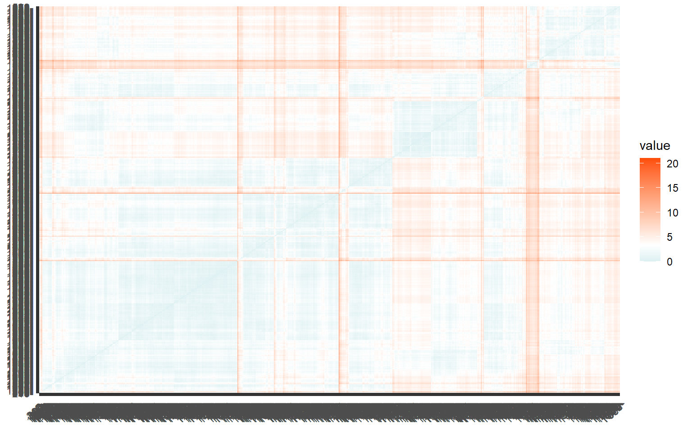
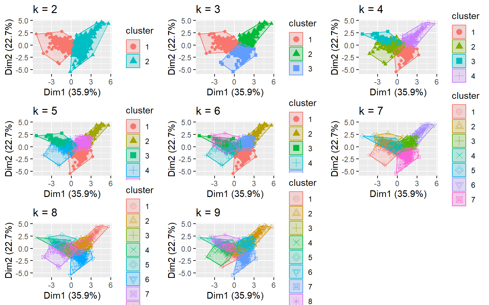
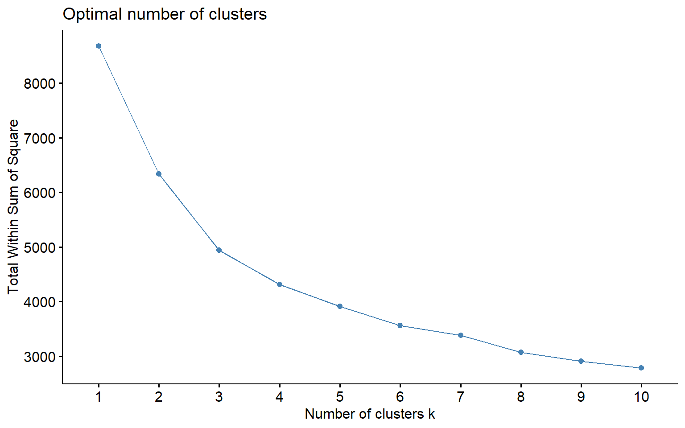
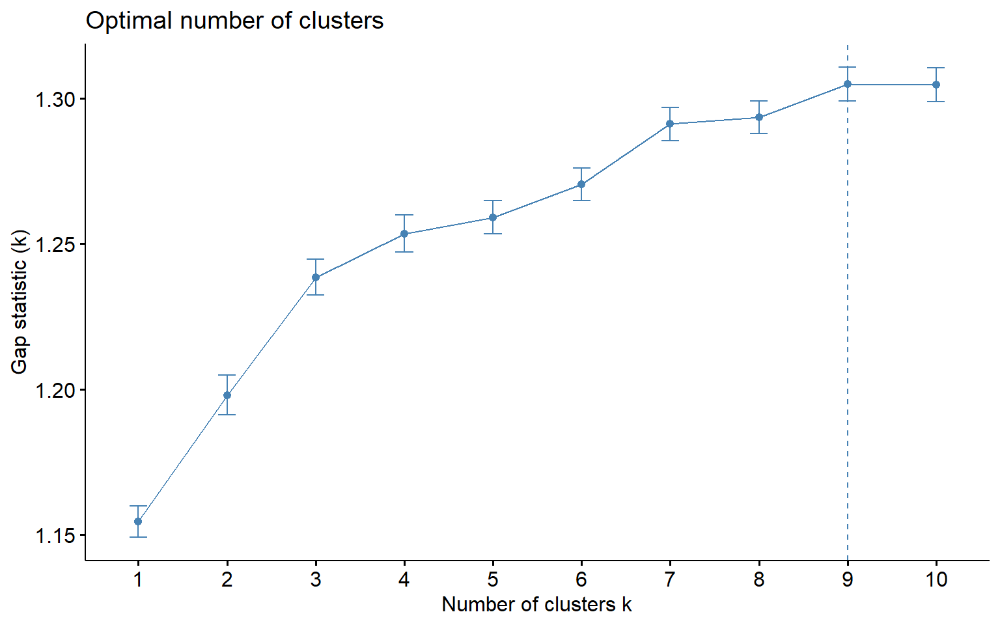
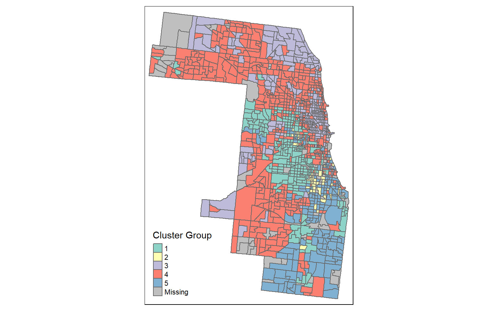
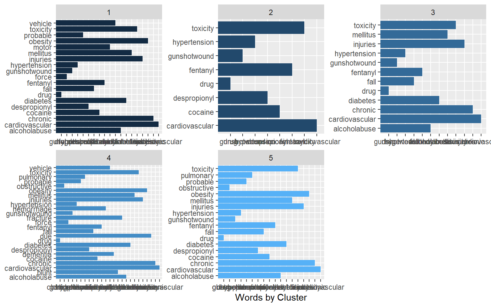
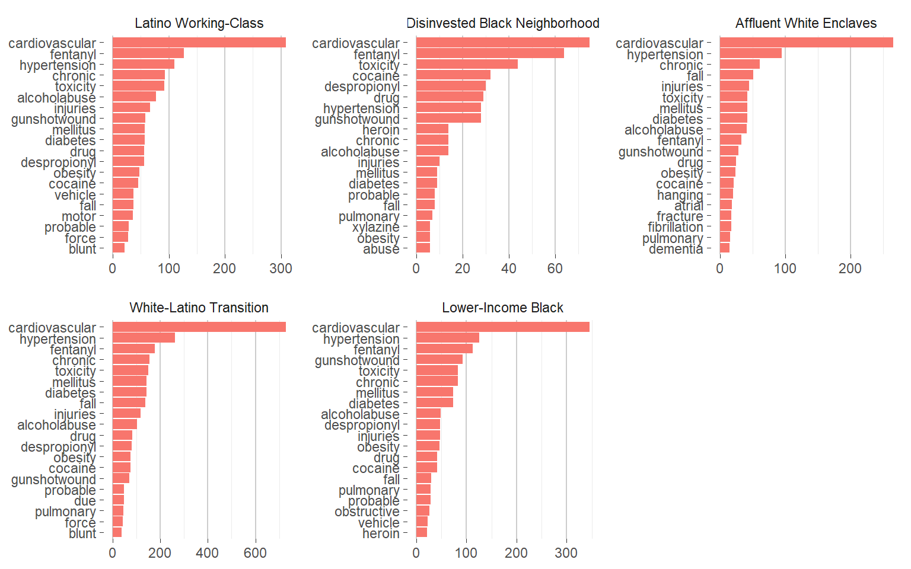
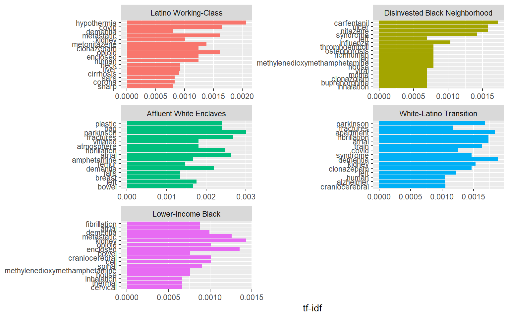
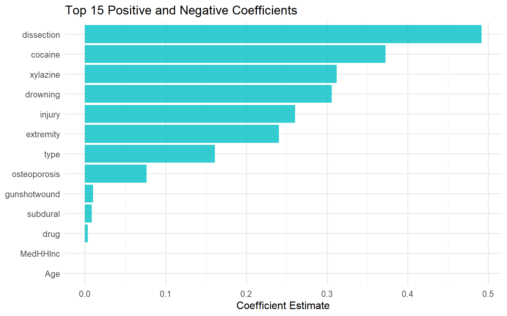

<script src="nbdclust_files/libs/kePrint-0.0.1/kePrint.js"></script>
<link href="nbdclust_files/libs/lightable-0.0.1/lightable.css" rel="stylesheet" />


This lab will follow the general workflow describe in the article:
Delmelle, E. C., & Nilsson, I. (2021). The language of neighborhoods: A predictive-analytical framework based on property advertisement text and mortgage lending data. Computers, Environment and Urban Systems, 88, 101658.

First load the libraries

``` r
library(tidyverse)
```

    ── Attaching core tidyverse packages ──────────────────────── tidyverse 2.0.0 ──
    ✔ dplyr     1.1.4     ✔ readr     2.1.4
    ✔ forcats   1.0.0     ✔ stringr   1.5.1
    ✔ ggplot2   3.5.2     ✔ tibble    3.2.1
    ✔ lubridate 1.9.3     ✔ tidyr     1.3.0
    ✔ purrr     1.0.2     
    ── Conflicts ────────────────────────────────────────── tidyverse_conflicts() ──
    ✖ purrr::%||%()   masks base::%||%()
    ✖ dplyr::filter() masks stats::filter()
    ✖ dplyr::lag()    masks stats::lag()
    ℹ Use the conflicted package (<http://conflicted.r-lib.org/>) to force all conflicts to become errors

``` r
library(cluster)
library(sf)
```

    Linking to GEOS 3.11.2, GDAL 3.7.2, PROJ 9.3.0; sf_use_s2() is TRUE

``` r
library(factoextra)
```

    Welcome! Want to learn more? See two factoextra-related books at https://goo.gl/ve3WBa

``` r
library(gridExtra)
```


    Attaching package: 'gridExtra'

    The following object is masked from 'package:dplyr':

        combine

``` r
library(kableExtra)
```


    Attaching package: 'kableExtra'

    The following object is masked from 'package:dplyr':

        group_rows

``` r
library(stringr)
library(tidytext)
library(yardstick)
```


    Attaching package: 'yardstick'

    The following object is masked from 'package:readr':

        spec

``` r
library(rsample)
library(glmnet)
```

    Loading required package: Matrix

    Attaching package: 'Matrix'

    The following objects are masked from 'package:tidyr':

        expand, pack, unpack

    Loaded glmnet 4.1-8

``` r
library(broom)
library(tmap)
```

    Breaking News: tmap 3.x is retiring. Please test v4, e.g. with
    remotes::install_github('r-tmap/tmap')

``` r
library(tigris)
```

    To enable caching of data, set `options(tigris_use_cache = TRUE)`
    in your R script or .Rprofile.

``` r
library(tidycensus)
```

Load the data - first 2020 census tracts from Cook County then a csv file of data from the Home Mortgage Disclosure Act (HMDA) that has been aggregated to the census tract level.
We then join the two based on the census tract ID.

``` r
clt_tracts <- 
  get_acs(geography = "tract", 
          variables = c("B25026_001E","B02001_002E",
                        "B15001_050E","B15001_009E",
                        "B19013_001E","B25058_001E",
                        "B06012_002E"), 
          year=2020, state=17, county=031, 
          geometry=TRUE, output="wide") %>%
  st_transform('ESRI:102728') %>%
  rename(TotalPop = B25026_001E, 
         Whites = B02001_002E,
         FemaleBachelors = B15001_050E, 
         MaleBachelors = B15001_009E,
         MedHHInc = B19013_001E, 
         MedRent = B25058_001E,
         TotalPoverty = B06012_002E) %>%
  dplyr::select(-NAME, -starts_with("B")) %>%
  mutate(pctWhite = ifelse(TotalPop > 0, Whites / TotalPop,0),
         pctBachelors = ifelse(TotalPop > 0, ((FemaleBachelors + MaleBachelors) / TotalPop),0),
         pctPoverty = ifelse(TotalPop > 0, TotalPoverty / TotalPop, 0),
         year = "2020") %>%
  dplyr::select(-Whites, -FemaleBachelors, -MaleBachelors, -TotalPoverty) 
```

    Getting data from the 2016-2020 5-year ACS

    Downloading feature geometry from the Census website.  To cache shapefiles for use in future sessions, set `options(tigris_use_cache = TRUE)`.


      |                                                                            
      |                                                                      |   0%
      |                                                                            
      |                                                                      |   1%
      |                                                                            
      |=                                                                     |   1%
      |                                                                            
      |=                                                                     |   2%
      |                                                                            
      |==                                                                    |   2%
      |                                                                            
      |==                                                                    |   3%
      |                                                                            
      |===                                                                   |   4%
      |                                                                            
      |===                                                                   |   5%
      |                                                                            
      |====                                                                  |   5%
      |                                                                            
      |====                                                                  |   6%
      |                                                                            
      |=====                                                                 |   7%
      |                                                                            
      |=====                                                                 |   8%
      |                                                                            
      |======                                                                |   8%
      |                                                                            
      |======                                                                |   9%
      |                                                                            
      |=======                                                               |   9%
      |                                                                            
      |=======                                                               |  10%
      |                                                                            
      |========                                                              |  11%
      |                                                                            
      |========                                                              |  12%
      |                                                                            
      |=========                                                             |  12%
      |                                                                            
      |=========                                                             |  13%
      |                                                                            
      |==========                                                            |  14%
      |                                                                            
      |===========                                                           |  15%
      |                                                                            
      |===========                                                           |  16%
      |                                                                            
      |============                                                          |  17%
      |                                                                            
      |=============                                                         |  18%
      |                                                                            
      |=============                                                         |  19%
      |                                                                            
      |==============                                                        |  20%
      |                                                                            
      |===============                                                       |  21%
      |                                                                            
      |===============                                                       |  22%
      |                                                                            
      |================                                                      |  23%
      |                                                                            
      |=================                                                     |  24%
      |                                                                            
      |=================                                                     |  25%
      |                                                                            
      |==================                                                    |  26%
      |                                                                            
      |===================                                                   |  27%
      |                                                                            
      |===================                                                   |  28%
      |                                                                            
      |====================                                                  |  29%
      |                                                                            
      |=====================                                                 |  30%
      |                                                                            
      |=====================                                                 |  31%
      |                                                                            
      |======================                                                |  32%
      |                                                                            
      |=======================                                               |  33%
      |                                                                            
      |========================                                              |  34%
      |                                                                            
      |=========================                                             |  35%
      |                                                                            
      |=========================                                             |  36%
      |                                                                            
      |==========================                                            |  37%
      |                                                                            
      |===========================                                           |  38%
      |                                                                            
      |===========================                                           |  39%
      |                                                                            
      |============================                                          |  40%
      |                                                                            
      |=============================                                         |  41%
      |                                                                            
      |=============================                                         |  42%
      |                                                                            
      |==============================                                        |  43%
      |                                                                            
      |===============================                                       |  44%
      |                                                                            
      |================================                                      |  45%
      |                                                                            
      |================================                                      |  46%
      |                                                                            
      |=================================                                     |  47%
      |                                                                            
      |==================================                                    |  48%
      |                                                                            
      |==================================                                    |  49%
      |                                                                            
      |===================================                                   |  50%
      |                                                                            
      |====================================                                  |  51%
      |                                                                            
      |====================================                                  |  52%
      |                                                                            
      |=====================================                                 |  53%
      |                                                                            
      |======================================                                |  54%
      |                                                                            
      |======================================                                |  55%
      |                                                                            
      |=======================================                               |  56%
      |                                                                            
      |========================================                              |  56%
      |                                                                            
      |========================================                              |  57%
      |                                                                            
      |=========================================                             |  58%
      |                                                                            
      |==========================================                            |  59%
      |                                                                            
      |==========================================                            |  60%
      |                                                                            
      |===========================================                           |  61%
      |                                                                            
      |============================================                          |  62%
      |                                                                            
      |============================================                          |  63%
      |                                                                            
      |=============================================                         |  64%
      |                                                                            
      |==============================================                        |  65%
      |                                                                            
      |==============================================                        |  66%
      |                                                                            
      |===============================================                       |  67%
      |                                                                            
      |================================================                      |  68%
      |                                                                            
      |================================================                      |  69%
      |                                                                            
      |=================================================                     |  70%
      |                                                                            
      |==================================================                    |  71%
      |                                                                            
      |==================================================                    |  72%
      |                                                                            
      |===================================================                   |  73%
      |                                                                            
      |====================================================                  |  74%
      |                                                                            
      |====================================================                  |  75%
      |                                                                            
      |=====================================================                 |  76%
      |                                                                            
      |======================================================                |  77%
      |                                                                            
      |======================================================                |  78%
      |                                                                            
      |=======================================================               |  79%
      |                                                                            
      |========================================================              |  80%
      |                                                                            
      |=========================================================             |  81%
      |                                                                            
      |==========================================================            |  82%
      |                                                                            
      |==========================================================            |  83%
      |                                                                            
      |===========================================================           |  84%
      |                                                                            
      |============================================================          |  85%
      |                                                                            
      |============================================================          |  86%
      |                                                                            
      |=============================================================         |  87%
      |                                                                            
      |==============================================================        |  88%
      |                                                                            
      |==============================================================        |  89%
      |                                                                            
      |===============================================================       |  90%
      |                                                                            
      |================================================================      |  91%
      |                                                                            
      |================================================================      |  92%
      |                                                                            
      |=================================================================     |  93%
      |                                                                            
      |==================================================================    |  94%
      |                                                                            
      |==================================================================    |  95%
      |                                                                            
      |===================================================================   |  96%
      |                                                                            
      |====================================================================  |  97%
      |                                                                            
      |====================================================================  |  98%
      |                                                                            
      |===================================================================== |  99%
      |                                                                            
      |======================================================================| 100%

``` r
hmda<- read.csv('../../../static/media/tract_change_summary.csv')
min16 <- read.csv("C:/Users/barboza-salerno.1/Downloads/min16.csv") %>% rename(GEOID = FIPS, min16 = EP_MINRTY) %>% mutate(GEOID = as.character(GEOID))
min22 <- read.csv("C:/Users/barboza-salerno.1/Downloads/min22.csv") %>% rename(GEOID = FIPS, min22 = EP_MINRTY) %>% mutate(GEOID = as.character(GEOID))
hmda$GEOID <- as.character(hmda$census_tract)
test1<- inner_join(min16, min22, by = c("GEOID" = "GEOID"))
test2<- inner_join(test1, hmda, by = c("GEOID" = "GEOID"))
cltdata<- inner_join(clt_tracts, test2, by = c("GEOID" = "GEOID"))
cltdata$chmin <- cltdata$min22 - cltdata$min16
```

``` r
cltdata <- cltdata %>% 
  mutate_if(is.character,as.numeric) %>% 
  dplyr::select( c("GEOID","pct_black_2018","pct_white_2018","pct_hispanic_2018","med_income_2018","delta_black","delta_white","delta_income","delta_hispanic", "pctPoverty", "min22" )) %>% 
  st_drop_geometry(.) %>%
  na.omit(.)
```

    Warning: There was 1 warning in `stopifnot()`.
    ℹ In argument: `state_code = .Primitive("as.double")(state_code)`.
    Caused by warning:
    ! NAs introduced by coercion

``` r
summary_stats <- cltdata %>%
  summarise(across(
    .cols = where(is.numeric),
    .fns = list(
      mean = ~mean(.x, na.rm = TRUE),
      sd = ~sd(.x, na.rm = TRUE),
      min = ~min(.x, na.rm = TRUE),
      max = ~max(.x, na.rm = TRUE)
    ),
    .names = "{.col}_{.fn}"
  ))

# View the result
print(summary_stats)
```

       GEOID_mean GEOID_sd   GEOID_min   GEOID_max pct_black_2018_mean
    1 17031561236 298703.3 17031010100 17031843900           0.1595742
      pct_black_2018_sd pct_black_2018_min pct_black_2018_max pct_white_2018_mean
    1         0.2792096                  0                  1           0.4339871
      pct_white_2018_sd pct_white_2018_min pct_white_2018_max
    1          0.305215                  0                  1
      pct_hispanic_2018_mean pct_hispanic_2018_sd pct_hispanic_2018_min
    1              0.2141145            0.2817931                     0
      pct_hispanic_2018_max med_income_2018_mean med_income_2018_sd
    1                     1             94.31895            52.2883
      med_income_2018_min med_income_2018_max delta_black_mean delta_black_sd
    1                  16                 459      -0.02147903      0.1791507
      delta_black_min delta_black_max delta_white_mean delta_white_sd
    1              -1               1      -0.06360403       0.168535
      delta_white_min delta_white_max delta_income_mean delta_income_sd
    1              -1               1          32.49395        37.34402
      delta_income_min delta_income_max delta_hispanic_mean delta_hispanic_sd
    1             -250              534          0.05790968         0.1914301
      delta_hispanic_min delta_hispanic_max pctPoverty_mean pctPoverty_sd
    1                 -1                  1        0.148429     0.1151205
      pctPoverty_min pctPoverty_max min22_mean min22_sd min22_min min22_max
    1    0.003858712      0.7388626   60.79387 29.50067       7.2       100

| Variable | Mean | SD | Min | Max |
|--------------------------------------|--------|--------|----------|----------|
| % Black Applicants 2019 | 0.160 | 0.279 | 0.000 | 1.000 |
| % White Applicants 2019 | 0.434 | 0.305 | 0.000 | 1.000 |
| % Latine Applicants 2019 | 0.214 | 0.282 | 0.000 | 1.000 |
| Median Income 2019 | \$94,319 | \$52,288 | \$16,000 | \$459,000 |
| % Change in Black Applicants (2019--2024) | -0.021 | 0.179 | -1.000 | 1.000 |
| % Change in White Applicants (2019--2024) | -0.064 | 0.169 | -1.000 | 1.000 |
| Change in Median Income 2019--2024 | \$32,494 | \$37,344 | -\$250,000 | \$534,000 |
| % Change in Latine Applicants (2019--2024) | 0.058 | 0.191 | -1.000 | 1.000 |
| % Poverty (2019--2024) | 0.148 | 0.115 | 0.004 | 0.739 |
| % Minoritized Group Membership 2024 | 60.794 | 29.501 | 7.2 | 100 |

``` r
data_scaled<- scale(cltdata[2:8])
distance <- get_dist(data_scaled)
fviz_dist(distance, gradient = list(low = "#00AFBB", mid = "white", high = "#FC4E07")) ##Not all that useful, but gives a sense of what we are going to try to cluster in the next steps.
```



``` r
set.seed(123)
k2 <- kmeans(data_scaled, centers = 2, nstart = 25)
k3 <- kmeans(data_scaled, centers = 3, nstart = 25)
k4 <- kmeans(data_scaled, centers = 4, nstart = 25)
k5 <- kmeans(data_scaled, centers = 5, nstart = 25)
k6 <- kmeans(data_scaled, centers = 6, nstart = 25)
k7 <- kmeans(data_scaled, centers = 7, nstart = 25)
k8 <- kmeans(data_scaled, centers = 8, nstart = 25)
k9 <- kmeans(data_scaled, centers = 9, nstart = 25)

p1 <- fviz_cluster(k2, geom = "point", data = data_scaled) + ggtitle("k = 2")
p2 <- fviz_cluster(k3, geom = "point",  data = data_scaled) + ggtitle("k = 3")
p3 <- fviz_cluster(k4, geom = "point",  data = data_scaled) + ggtitle("k = 4")
p4 <- fviz_cluster(k5, geom = "point",  data = data_scaled) + ggtitle("k = 5")
p5 <- fviz_cluster(k6, geom = "point",  data = data_scaled) + ggtitle("k = 6")
p6 <- fviz_cluster(k7, geom = "point",  data = data_scaled) + ggtitle("k = 7")
p7 <- fviz_cluster(k8, geom = "point",  data = data_scaled) + ggtitle("k = 8")
p8 <- fviz_cluster(k9, geom = "point",  data = data_scaled) + ggtitle("k = 9")

grid.arrange(p1, p2, p3, p4, p5, p6, p7, p8, nrow = 3)
```



``` r
fviz_nbclust(data_scaled, kmeans, method = "wss")
```



``` r
fviz_nbclust(data_scaled, kmeans, method = "silhouette")
```


``` r
set.seed(123)
gap_stat <- clusGap(
    data_scaled,
    FUN = function(x, k) kmeans(x, centers = k, nstart = 25, iter.max = 100),
    K.max = 10,
    B = 50
)
fviz_gap_stat(gap_stat)
```



``` r
cltclusters<- cltdata %>%
  mutate(cluster5 = k5$cluster) %>%
  group_by(cluster5) %>%
  summarise_all("mean") %>%
  dplyr::select(-c("GEOID"))
kable(x=cltclusters)%>%kable_classic()
```

    Warning in attr(x, "align"): 'xfun::attr()' is deprecated.
    Use 'xfun::attr2()' instead.
    See help("Deprecated")

| cluster5 | pct_black_2018 | pct_white_2018 | pct_hispanic_2018 | med_income_2018 | delta_black | delta_white | delta_income | delta_hispanic | pctPoverty | min22 |
|---:|---:|---:|---:|---:|---:|---:|---:|---:|---:|---:|
| 1 | 0.0581181 | 0.1090928 | 0.7190506 | 56.78270 | 0.0224219 | 0.0021435 | 30.07173 | -0.0560549 | 0.1907036 | 86.45612 |
| 2 | 0.9256275 | 0.0031373 | 0.0301961 | 63.65686 | -0.6396863 | 0.1034510 | 23.67647 | 0.3967451 | 0.3012222 | 97.23137 |
| 3 | 0.0174317 | 0.7026531 | 0.0430664 | 167.22509 | 0.0068708 | -0.0181144 | 51.17897 | 0.0135461 | 0.0828384 | 32.35240 |
| 4 | 0.0478817 | 0.6028876 | 0.1240217 | 86.88462 | 0.0282465 | -0.1567298 | 27.55720 | 0.0841006 | 0.1248993 | 49.98383 |
| 5 | 0.6200632 | 0.0922184 | 0.1091782 | 62.54598 | -0.0891207 | -0.0016207 | 23.66092 | 0.1066034 | 0.2167798 | 90.95517 |

``` r
cltdata <- cltdata %>%
  mutate(cluster5 = k5$cluster)
cltdata$GEOID<-as.character(as.numeric(cltdata$GEOID))

joined<-left_join(clt_tracts, cltdata, by = "GEOID")
```

``` r
joined_clean <- joined %>%
  filter(!st_is_empty(geometry))  # removes the 1 empty geometry

# Now plot
tm_shape(joined_clean) +
  tm_polygons(col = "cluster5", style = "cat", palette = "Set3", title = "Cluster Group")
```



``` r
library(dplyr)
library(stringr)

me_data <- read.csv("C:/Users/barboza-salerno.1/Downloads/Medical_Examiner_Case_Archive_20250712.csv")

library(dplyr)
library(stringr)

me_data <- me_data %>%
  mutate(across(
    c(Primary.Cause, Primary.Cause.Line.A, Primary.Cause.Line.B, Primary.Cause.Line.C, Secondary.Cause),
    ~na_if(str_trim(.x), "")
  )) %>%
  mutate(across(
    c(Primary.Cause, Primary.Cause.Line.A, Primary.Cause.Line.B, Primary.Cause.Line.C, Secondary.Cause),
    ~na_if(.x, "NA")
  )) %>%
  rowwise() %>%
  mutate(
    cause_text = {
      # Collect non-missing values
      parts <- na.omit(c_across(c(
        Primary.Cause,
        Primary.Cause.Line.A,
        Primary.Cause.Line.B,
        Primary.Cause.Line.C,
        Secondary.Cause
      )))
      
      # Remove repeated phrases (keep first appearance)
      unique_parts <- character()
      for (part in parts) {
        if (!any(str_detect(unique_parts, fixed(part)))) {
          unique_parts <- c(unique_parts, part)
        }
      }

      str_squish(paste(unique_parts, collapse = " | "))
    }
  ) %>%
  ungroup()
```

``` r
me_sf <- me_data %>%
  filter(!is.na(longitude) & !is.na(latitude)) %>%
  st_as_sf(coords = c("longitude", "latitude"), crs = 4326)  # assuming WGS84

# STEP 2: Transform ME data to match CRS of census tracts
me_sf_transformed <- st_transform(me_sf, crs = st_crs(joined))

# STEP 3: Spatial join — assign each ME record to a tract
me_with_tract <- st_join(me_sf_transformed, joined)
```

``` r
me_with_tract$cause_text <- me_with_tract$cause_text %>%
  trimws() %>%
  tolower() %>%
  str_replace_all("(\\.+|[[:punct:]])", " \\1 ") # optional punctuation cleanup

me_with_tract$cause_text <- str_replace_all(
  me_with_tract$cause_text,
  "\\bmultiple gunshot wounds?\\b|\\bgunshot wound(s)?( to| of)? [a-z ]+\\b|\\bgunshot wound\\b",
  "gunshotwound"
)

me_with_tract$cause_text <- tolower(me_with_tract$cause_text)
me_with_tract$cause_text <- str_replace_all(me_with_tract$cause_text, "hypertensive", "hypertension")
me_with_tract$cause_text <- str_replace_all(me_with_tract$cause_text, "ethanolism", "alcoholabuse")
me_with_tract$cause_text <- str_replace_all(me_with_tract$cause_text, "ethanol", "alcoholabuse")
me_with_tract$cause_text <- str_replace_all(me_with_tract$cause_text, "atherosclerotic", "cardiovascular")
me_with_tract$cause_text <- str_replace_all(me_with_tract$cause_text, "arteriosclerotic", "cardiovascular")
me_with_tract$cause_text <- str_replace_all(me_with_tract$cause_text, "hypertensive cardiovascular disease", "cardiovascular")


# 2. Define custom remove list (medical and non-informative words)
remove_list <- c(
  "anpp", "combined", "complicated", "complications", "disease", "lower", "multiple", "complicating", "complication", "comlications", "organic"
)

# 3. Tokenize and filter
words <- me_with_tract %>%
  dplyr::select(cause_text, GEOID) %>%
  unnest_tokens(word, cause_text) %>%
  filter(!word %in% stop_words$word) %>%
  filter(!word %in% remove_list) %>%
  filter(!grepl("[0-9]", word)) %>%
  filter(!is.na(GEOID))

# 4. Drop rare terms
words <- words %>%
  add_count(word) %>%
  filter(n >= 5) %>%
  dplyr::select(-n)
```

``` r
words<- me_with_tract %>% unnest_tokens(word, cause_text) %>% anti_join(stop_words) %>% 
  filter(!word %in% remove_list)%>% 
  filter(!grepl('[0-9]', word))%>%filter(!cluster5 == 0)%>%st_drop_geometry(.)
```

    Joining with `by = join_by(word)`

``` r
#Remove words that only occurs less than 5 times
words$nn <- ave(words$word,words$word, FUN=length)
words$nn <- as.numeric(words$nn)
words<- words[ -which( words$nn <5), ]
```

``` r
words_by_neighborhood <- words %>%
  count(cluster5, word, sort = TRUE) %>%
  ungroup()

words_by_neighborhood %>%
  filter(n >= 25) %>% 
  arrange(n) %>%
  group_by(cluster5) %>%
  top_n(25, n) %>%
  ungroup() %>%
  mutate(n = factor(word, unique(word))) %>%
  ggplot(aes(word, n, fill = cluster5)) +
  geom_col(show.legend = FALSE) +
  facet_wrap(~ cluster5, scales = "free", ncol = 3) +
  coord_flip() +
  labs(x = NULL, 
       y = "Words by Cluster")
```



``` r
# 1. Define proper cluster labels for 7 clusters
cluster.lab <- c(
  '1' = "Latino Working-Class",
  '2' = "Disinvested Black Neighborhood",
  '3' = "Affluent White Enclaves",
  '4' = "White-Latino Transition",
  '5' = "Lower-Income Black"
)

# 2. Make sure your cluster column is named cluster7 and is a factor
words_by_neighborhood$cluster5 <- factor(words_by_neighborhood$cluster5)

# 3. Prepare plotting list
names <- levels(words_by_neighborhood$cluster5)
plist <- list()

# 4. Loop through each cluster and generate plots
for (i in seq_along(names)) {
  d <- subset(words_by_neighborhood, cluster5 == names[i])
  d <- subset(d, n >= 5)
  d <- head(d[order(-d$n), ], 20)  # Top 20 most frequent
  d$word <- factor(d$word, levels = d$word[order(d$n)])

  p1 <- ggplot(d, aes(x = word, y = n, fill = cluster5)) + 
    labs(y = NULL, x = NULL, fill = NULL) +
    geom_bar(stat = "identity") +
    facet_wrap(~cluster5, scales = "free", labeller = as_labeller(cluster.lab)) +
    coord_flip() +
    guides(fill = FALSE) +
    theme_bw() +
    theme(
      strip.background = element_blank(),
      panel.grid.major = element_line(colour = "grey80"),
      panel.border = element_blank(),
      axis.ticks = element_line(size = 0),
      panel.grid.minor.y = element_blank(),
      panel.grid.major.y = element_blank(),
      legend.position = "bottom"
    )

  plist[[names[i]]] <- p1
}
```

    Warning: The `<scale>` argument of `guides()` cannot be `FALSE`. Use "none" instead as
    of ggplot2 3.3.4.

    Warning: The `size` argument of `element_line()` is deprecated as of ggplot2 3.4.0.
    ℹ Please use the `linewidth` argument instead.

``` r
# 5. Display all plots in a grid (adjust ncol to your layout)
do.call("grid.arrange", c(plist, ncol = 3))
```



``` r
cluster_tf_idf <- words_by_neighborhood %>%
  bind_tf_idf(word, cluster5, n)

cluster_tf_idf %>%
  group_by(cluster5) %>%
  slice_max(tf_idf, n = 15) %>%
  ungroup() %>%
  ggplot(aes(tf_idf, fct_reorder(word, tf_idf), fill = cluster5)) +
  geom_col(show.legend = FALSE) +
  facet_wrap(~cluster5, ncol = 2, scales = "free", labeller = as_labeller(cluster.lab)) +
  labs(x = "tf-idf", y = NULL)
```



We then split into a testing and training dataset

``` r
#Make binomial variables for each cluster (could be put in an elegant loop but...)

me_with_tract<-st_drop_geometry(me_with_tract)


# Create dummy variables for clusters 1 through 7
for (i in 1:5) {
  me_with_tract[[paste0("cluster", i)]] <- ifelse(me_with_tract$cluster5 == i, 1, 0)
  words[[paste0("cluster", i)]] <- ifelse(words$cluster5 == i, 1, 0)
}


data_split <- me_with_tract %>% dplyr::select(Case.Number)
data_split <- initial_split(data_split)
train_data <- training(data_split)
test_data <- testing(data_split)

#transform training data from tidy data structure to a sparse matrix
sparse_words <- words %>%
  count(Case.Number, word) %>%
  inner_join(train_data) %>%
  cast_sparse(Case.Number, word, n)
```

    Joining with `by = join_by(Case.Number)`

``` r
class(sparse_words)
```

    [1] "dgCMatrix"
    attr(,"package")
    [1] "Matrix"

``` r
dim(sparse_words)
```

    [1] 2017  229

``` r
word_rownames <- rownames(sparse_words)

data_joined <- data_frame(Case.Number = word_rownames) %>%
  left_join(me_with_tract %>%
              dplyr::select(Case.Number, cluster1, cluster2, cluster3, cluster4, cluster5))
```

    Warning: `data_frame()` was deprecated in tibble 1.1.0.
    ℹ Please use `tibble()` instead.

    Joining with `by = join_by(Case.Number)`

It is finally time to run the logistic regression. This code will work for one cluster at a time and graph the largest positive and negative words associated with each neighborhood type. Again, we see the importance of specific neighborhood names as most discriminating. To get more interesting keywords, we need to filter out these specific neighborhood names and replace them with a generic placeholder. You'll also notice some odd words that are likely misspellings pop up because they are rare and therefore highly discriminating of one neighborhood type. That's where the iterative cleaning comes into play - the influence of these rare words is also an artifact of having a relatively small sample of real estate listings used in this illustrative example.

We found a handy real estate dictionary that helped us get started in cleaning our much larger dataset that is very expensive and cannot be shared with you! But if you find yourself some money, and want to re-create the analysis on real MLS data check out: https://github.com/browak/Nowak-Price-Smith-JREFE-2019
We ended up adding to those words with a full list of neighborhood names. I added that file to the github site for reference.

``` r
#Run model on training data (slow) for clusterX

is_cluster <- data_joined$cluster2 == 1 #<--- change clusterX to whatever cluster you want to plot

model <- cv.glmnet(sparse_words, is_cluster,
                   family = "binomial", intercept = TRUE
                   #parallel = TRUE, keep = TRUE
)

weights <- ifelse(data_joined$cluster2 == 1, 1, 0.25)
model<- cv.glmnet(sparse_words, is_cluster, family = "binomial", weights = weights)
#Pull out coefficients
coefs <- model$glmnet.fit %>%
  tidy() %>%
  filter(lambda == model$lambda.min)

#Plot coefficients 
coefs %>%
  group_by(estimate > 0) %>%
  top_n(15, abs(estimate)) %>%
  ungroup() %>%
  ggplot(aes(fct_reorder(term, estimate), estimate, fill = estimate > 0)) +
  geom_col(alpha = 0.8, show.legend = FALSE) +
  coord_flip() + theme(axis.text=element_text(size=11)) +
  labs(
    x = NULL,
    title = "15 largest/smallest coefficients")
```


Now we can see how well we can predict the type of neighborhood a listing belongs to based on the coefficients of the words contained in the listing. Remember, since we converted it to a binary problem, we are testing one class at a time. In other words, is the listing in class 1? Yes or no, given what we've learned. We follow with our favorite confusion matrix. In this case, we are much better at predicting it DOESN'T belong to a certain class than identify the true class. Many more True Negatives than True Positives. We could also fiddle around with the 0.8 threshold to see how that alters the prediction results.

``` r
#Prediction 

intercept <- coefs %>%
  filter(term == "(Intercept)") %>%
  pull(estimate)

classifications <- words %>%
  inner_join(test_data) %>%
  inner_join(coefs, by = c("word" = "term")) %>%
  group_by(Case.Number) %>%
  summarize(score = sum(estimate)) %>%
  mutate(probability = plogis(intercept + score))
```

    Joining with `by = join_by(Case.Number)`

``` r
comment_classes <- classifications %>%
  left_join(me_with_tract %>%
              dplyr::select(cluster2, Case.Number), by = "Case.Number") %>% #change here to clusterX 
  mutate(cluster2 = as.factor(cluster2)) #change here to clusterX 


## Confusion matrix
# at 0.8 threshold
library(yardstick)
library(dplyr)

comment_classes <- comment_classes %>%
  mutate(
    prediction = case_when(
      probability > 0.5 ~ "1",
      TRUE ~ "0"
    ),
    prediction = as.factor(prediction),
    cluster2 = as.factor(cluster2)  # or cluster2 if that's your target
  )
```

``` r
library(glmnet)
library(dplyr)
library(ggplot2)
library(forcats)
library(broom)

for (cluster_num in 1:5) {
  
  cluster_name <- paste0("cluster", cluster_num)
  cat("\n------------------", cluster_name, "------------------\n")
  
  # Step 1: Define binary outcome and weights
  is_cluster <- data_joined[[cluster_name]] == 1
  weights <- ifelse(is_cluster, 1, 0.25)
  
  # Step 2: Fit weighted logistic regression with cross-validation
  model <- cv.glmnet(sparse_words, is_cluster, family = "binomial", weights = weights)
  
  # Step 3: Extract coefficients
  coefs <- broom::tidy(model$glmnet.fit) %>%
    filter(lambda == model$lambda.min)
  
  # Step 4: Plot top coefficients
  coefs %>%
    filter(term != "(Intercept)") %>%
    group_by(estimate > 0) %>%
    top_n(15, abs(estimate)) %>%
    ungroup() %>%
    ggplot(aes(fct_reorder(term, estimate), estimate, fill = estimate > 0)) +
    geom_col(show.legend = FALSE, alpha = 0.8) +
    coord_flip() +
    theme_minimal() +
    labs(title = paste("Top Coefficients for", cluster_name), x = NULL, y = "Estimate")
  
  # Step 5: Predict using coefficients
  intercept <- coefs %>% filter(term == "(Intercept)") %>% pull(estimate)
  beta_coefs <- coefs %>% filter(term != "(Intercept)") %>%
    rename(word = term)

  classifications <- words %>%
    inner_join(beta_coefs, by = "word") %>%
    group_by(Case.Number) %>%
    summarize(score = sum(estimate), .groups = "drop") %>%
    mutate(probability = plogis(intercept + score))
  
  # Step 6: Attach ground truth and create predictions
  comment_classes <- classifications %>%
    left_join(me_with_tract %>% select(Case.Number, !!sym(cluster_name)), by = "Case.Number") %>%
    rename(truth = !!sym(cluster_name)) %>%
    mutate(
      prediction = if_else(probability > 0.7, 1, 0)
    )
  
  # Step 7: Evaluation metrics
  TP <- sum(comment_classes$truth == 1 & comment_classes$prediction == 1)
  TN <- sum(comment_classes$truth == 0 & comment_classes$prediction == 0)
  FP <- sum(comment_classes$truth == 0 & comment_classes$prediction == 1)
  FN <- sum(comment_classes$truth == 1 & comment_classes$prediction == 0)
  
  accuracy <- (TP + TN) / (TP + TN + FP + FN)
  sensitivity <- TP / (TP + FN)
  specificity <- TN / (TN + FP)
  precision <- ifelse((TP + FP) == 0, NA, TP / (TP + FP))
  f1 <- ifelse(is.na(precision) | (sensitivity + precision) == 0, NA,
               2 * (precision * sensitivity) / (precision + sensitivity))
  
  # Print metrics
  cat("Accuracy:   ", round(accuracy, 3), "\n")
  cat("Sensitivity:", round(sensitivity, 3), "\n")
  cat("Specificity:", round(specificity, 3), "\n")
  cat("Precision:  ", round(precision, 3), "\n")
  cat("F1 Score:   ", round(f1, 3), "\n")
}
```


    ------------------ cluster1 ------------------
    Accuracy:    0.802 
    Sensitivity: 0.014 
    Specificity: 0.999 
    Precision:   0.75 
    F1 Score:    0.027 

    ------------------ cluster2 ------------------
    Accuracy:    0.89 
    Sensitivity: 0 
    Specificity: 1 
    Precision:   NA 
    F1 Score:    NA 

    ------------------ cluster3 ------------------
    Accuracy:    0.86 
    Sensitivity: 0.024 
    Specificity: 0.998 
    Precision:   0.667 
    F1 Score:    0.046 

    ------------------ cluster4 ------------------
    Accuracy:    0.763 
    Sensitivity: 0 
    Specificity: 1 
    Precision:   NA 
    F1 Score:    NA 

    ------------------ cluster5 ------------------
    Accuracy:    0.807 
    Sensitivity: 0 
    Specificity: 1 
    Precision:   NA 
    F1 Score:    NA 

``` r
library(Matrix)
library(dplyr)
library(tidyr)
library(glmnet)
library(broom)
library(ggplot2)
library(forcats)

library(dplyr)
library(tidyr)
library(Matrix)
library(glmnet)
library(broom)
library(ggplot2)
library(forcats)
library(text2vec)

# --- Step 1: Sparse matrix of word counts ---
sparse_words <- words %>%
  count(Case.Number, word) %>%
  inner_join(train_data, by = "Case.Number") %>%
  cast_sparse(Case.Number, word, n)

# --- Step 2: Prepare covariates ---
# Ensure covariates include Case.Number and match sparse matrix
covariate_vars <- c("Case.Number", "MedHHInc", "Age", "Gender")  # adjust as needed

covariate_data <- me_with_tract %>%
  dplyr::select(all_of(covariate_vars)) %>%
  drop_na()  # drop missing rows

# --- Step 3: Align rows of sparse matrix and covariates ---
common_ids <- intersect(rownames(sparse_words), covariate_data$Case.Number)

sparse_words_clean <- sparse_words[common_ids, ]
covariate_data_clean <- covariate_data %>%
  filter(Case.Number %in% common_ids) %>%
  arrange(match(Case.Number, common_ids))

# --- Step 4: Create covariate matrix ---
X_covariates <- model.matrix(~ ., data = covariate_data_clean %>% select(-Case.Number))[ , -1]

# --- Step 5: Combine text + covariates ---
X_full <- cbind(sparse_words_clean, X_covariates)

# --- Step 6: Define outcome and weights ---
data_aligned <- me_with_tract %>%
  filter(Case.Number %in% rownames(X_full)) %>%
  arrange(match(Case.Number, rownames(X_full)))

# Replace 'cluster2' with your desired binary outcome variable
is_cluster <- data_aligned$cluster2 == 1
weights <- ifelse(is_cluster, 1, 0.25)

# --- Step 7: Fit glmnet model ---
model <- cv.glmnet(X_full, is_cluster, family = "binomial", weights = weights)

# --- Step 8: Extract coefficients at optimal lambda ---
coefs <- tidy(model$glmnet.fit) %>%
  filter(lambda == model$lambda.min)

# --- Step 9: Plot top coefficients ---
coefs %>%
  filter(term != "(Intercept)") %>%
  group_by(estimate > 0) %>%
  slice_max(order_by = abs(estimate), n = 15) %>%
  ungroup() %>%
  ggplot(aes(fct_reorder(term, estimate), estimate, fill = estimate > 0)) +
  geom_col(alpha = 0.8, show.legend = FALSE) +
  coord_flip() +
  theme_minimal(base_size = 12) +
  labs(
    title = "Top 15 Positive and Negative Coefficients",
    x = NULL,
    y = "Coefficient Estimate"
  )
```



``` r
library(yardstick)
library(dplyr)
library(tibble)

# --- Define cluster mapping ---
cluster_labels <- c(
    cluster1 = "Latino Working-Class",
    cluster2 = "Disinvested Black Neighborhood",
    cluster3 = "Affluent White Enclaves",
    cluster4 = "White-Latino Transition",
    cluster5 = "Lower-Income Black"
)
```

``` r
# --- Initialize list to store model results ---
results_list <- list()

for (cluster_col in names(cluster_labels)) {
    
    # --- Define outcome ---
    data_aligned <- data_joined %>%
        filter(Case.Number %in% rownames(X_full)) %>%
        arrange(match(Case.Number, rownames(X_full)))
    
    is_cluster <- data_aligned[[cluster_col]] == 1
    weights <- ifelse(is_cluster, 1, 0.25)

    # --- Fit model ---
    model <- cv.glmnet(X_full, is_cluster, family = "binomial", weights = weights)
    
    # --- Extract coefficients ---
    coefs <- broom::tidy(model$glmnet.fit) %>% 
        filter(lambda == model$lambda.min)
    
    intercept <- coefs %>% filter(term == "(Intercept)") %>% pull(estimate)
    beta_coefs <- coefs %>% filter(term != "(Intercept)")
    
    matched_beta <- beta_coefs %>%
        filter(term %in% colnames(X_full)) %>%
        arrange(match(term, colnames(X_full)))
    
    X_mat <- X_full[, matched_beta$term]
    score <- as.numeric(X_mat %*% matched_beta$estimate) + intercept
    probability <- plogis(score)
    prediction_vec <- ifelse(probability > 0.7, 1, 0)
    
    # --- Create eval_data ---
    eval_data <- data.frame(
        Case.Number = rownames(X_full),
        truth = factor(is_cluster, levels = c(FALSE, TRUE), labels = c(0, 1)),
        prediction = factor(prediction_vec, levels = c(0, 1))
    )
    
    # --- Compute metrics ---
    acc  <- accuracy(eval_data, truth = truth, estimate = prediction)$.estimate
    sens <- sensitivity(eval_data, truth = truth, estimate = prediction)$.estimate
    spec <- specificity(eval_data, truth = truth, estimate = prediction)$.estimate
    prec <- precision(eval_data, truth = truth, estimate = prediction)$.estimate
    f1   <- f_meas(eval_data, truth = truth, estimate = prediction)$.estimate
    
    # --- Store results ---
    results_list[[cluster_col]] <- tibble(
        cluster = cluster_col,
        label = cluster_labels[[cluster_col]],
        Accuracy = round(acc, 3),
        Sensitivity = round(sens, 3),
        Specificity = round(spec, 3),
        Precision = round(prec, 3),
        F1_Score = round(f1, 3)
    )
}

# Combine into results table
results_all <- bind_rows(results_list)
print(results_all)
```

    # A tibble: 5 × 7
      cluster  label             Accuracy Sensitivity Specificity Precision F1_Score
      <chr>    <chr>                <dbl>       <dbl>       <dbl>     <dbl>    <dbl>
    1 cluster1 Latino Working-C…    0.794       0.971       0.08      0.81     0.883
    2 cluster2 Disinvested Blac…    0.943       1           0         0.943    0.971
    3 cluster3 Affluent White E…    0.902       0.968       0.52      0.92     0.944
    4 cluster4 White-Latino Tra…    0.504       0.265       0.858     0.734    0.39 
    5 cluster5 Lower-Income Bla…    0.784       0.922       0.204     0.829    0.873
