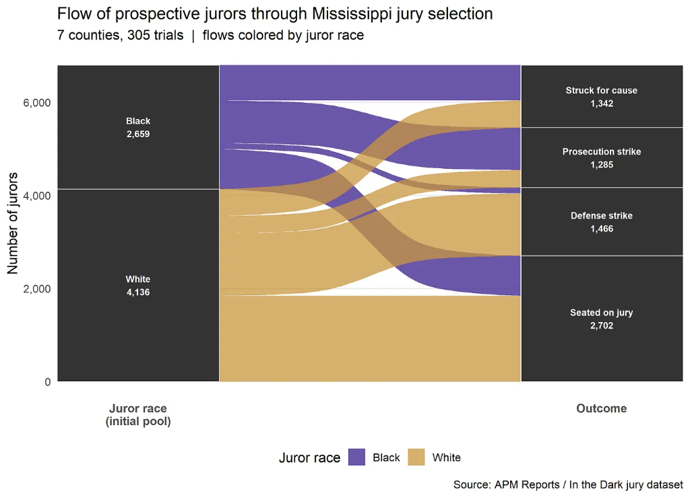
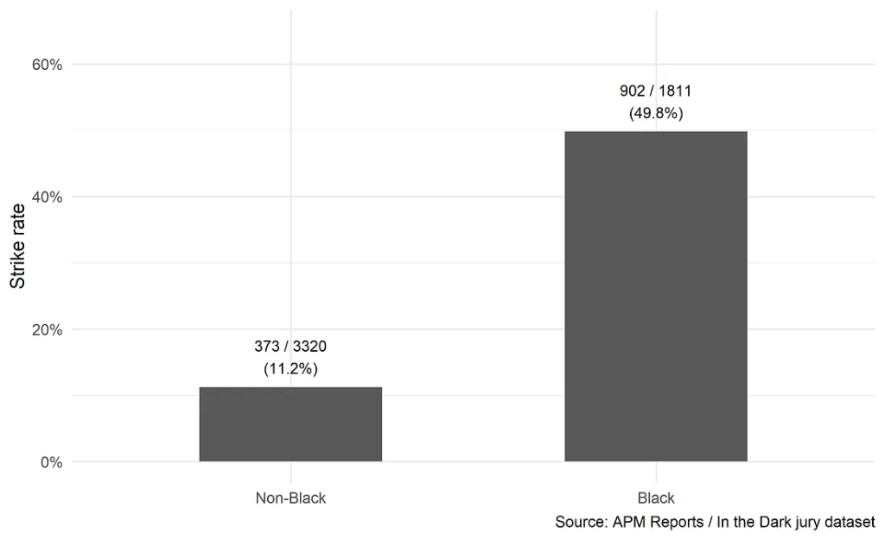
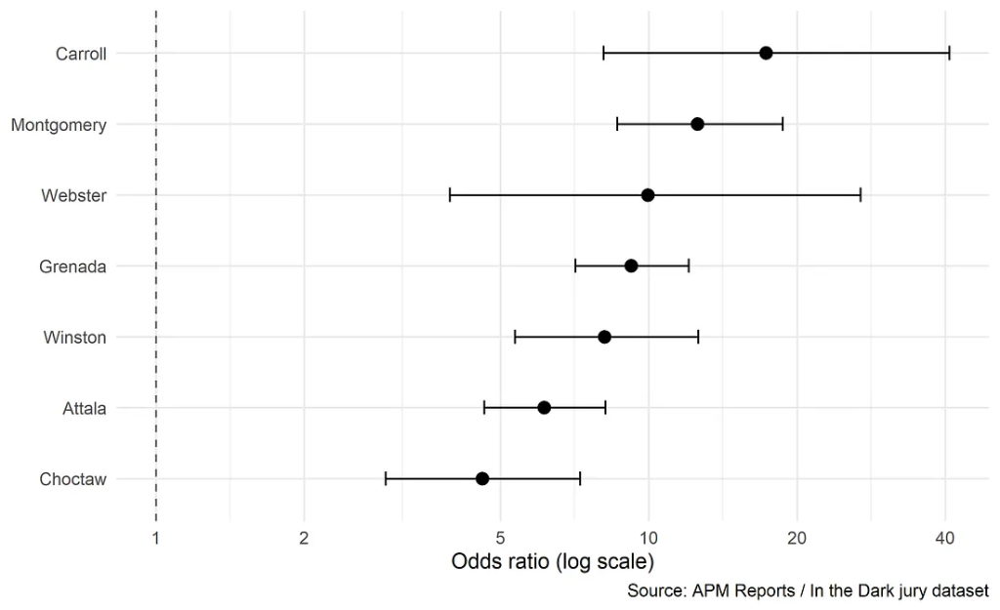
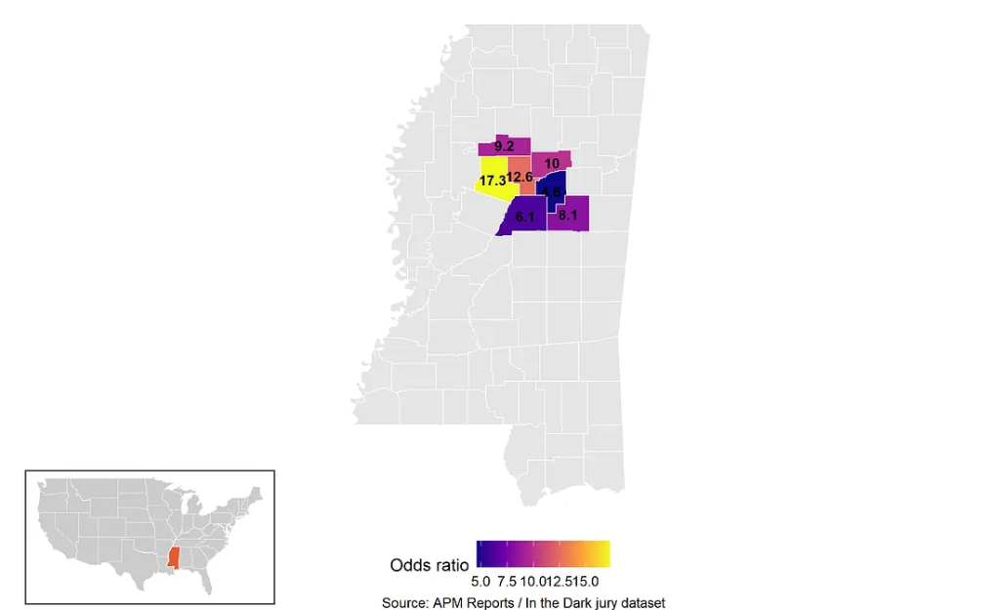
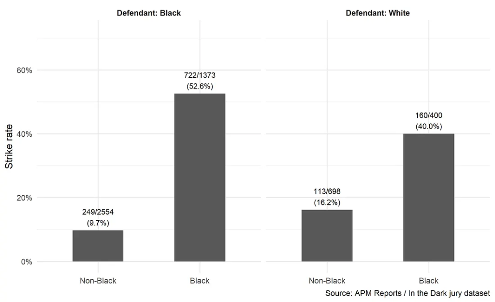
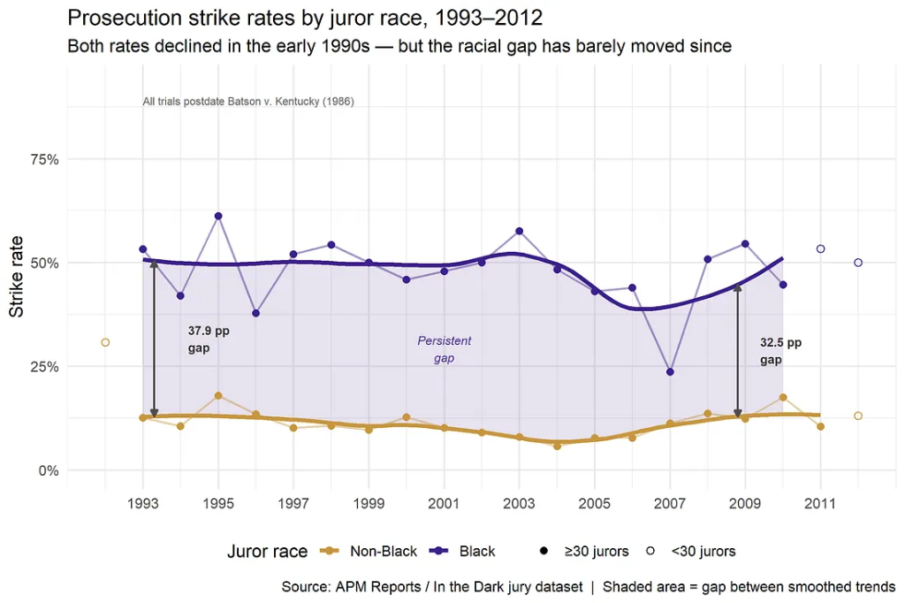
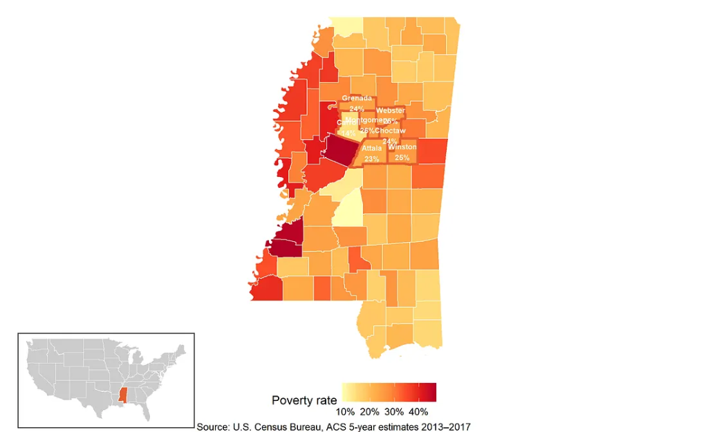
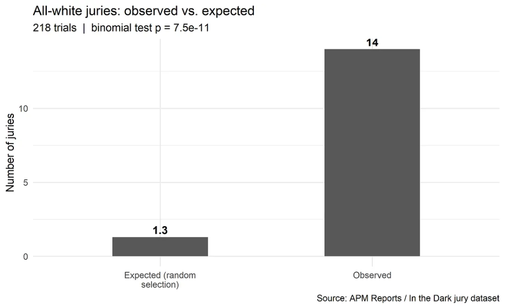

In *Batson v. Kentucky* (1986), the Supreme Court held that prosecutors may not exclude potential jurors solely because of their race. Nearly four decades later, questions about racial disparities in jury selection continue to arise. They resurfaced during the 2026 murder trial of Karmelo Anthony, where the defense raised a Batson challenge after all eligible Black jurors were removed from the pool and an all-White jury was ultimately seated.

The Anthony case cannot be evaluated using the Mississippi data analyzed here. It occurred in a different state, a different county, and under different circumstances, and nothing below should be read as a claim about it. However, the case does bring up an important question that the criminal legal system should confront: if race-based juror exclusion is unconstitutional, do measurable racial disparities in jury selection still persist? To examine that question, I reanalyzed a publicly available dataset assembled by APM Reports containing jury selection records from 305 criminal trials in Mississippi's Fifth Circuit Court District spanning roughly 1991–2017.

## Five Key Findings

1. **Racial disparity in prosecution strikes persisted after Batson.** Black jurors remained roughly 37–38 percentage points more likely than non-Black jurors to be struck by prosecutors, even as overall strike rates declined.
2. **All-White juries occurred far more often than a race-neutral process would predict.** Across 218 trials with complete jury-composition data, 14 juries contained no Black members. Under race-neutral selection, the model predicts roughly 1.3.
3. **The disparity was robust across statistical approaches.** The odds of a Black eligible juror being struck are nearly eight times those of non-Black jurors, and the gap persisted after adjusting for county, defendant race, and trial-level clustering.
4. **The disparity persisted even when defendants were White.** The pattern cannot be explained solely as an effort to match juror demographics to defendant demographics.
5. **Every county examined showed a statistically significant disparity.** The magnitude varied; no county showed the gap disappearing.

*These are descriptions of patterns in a particular, non-random sample of trials. They are not, and should not be read as, determinations of intent in any individual decision, nor as population estimates for trials in general.*

---

## Overview

In 2018, reporters working on the podcast *In the Dark* published a detailed statistical investigation of jury selection in Mississippi's Fifth Circuit Court District. Their analysis documented that, across hundreds of criminal trials in seven counties, prosecutors used their discretionary "peremptory" challenges to remove Black prospective jurors at rates far exceeding those for white jurors. That investigation is available at: [features.apmreports.org/in-the-dark/mississippi-district-attorney-striking-black-jurors/](https://features.apmreports.org/in-the-dark/mississippi-district-attorney-striking-black-jurors/)

This article independently replicates the findings reported by APM Reports using publicly available jury selection data and extends the analysis through multilevel modeling, county-level decomposition, time-trend analyses, and probability-based estimates of how often the observed outcomes would be expected under race-neutral jury selection. The article concludes by placing the 2026 murder trial of Karmelo Anthony in a broader historical context. While the Mississippi data cannot determine what occurred in that specific case, the questions it raised about Batson challenges, race-neutral explanations for juror strikes, and the seating of an all-White jury are consistent with these historical patterns.

Throughout, the analysis is descriptive and statistical. Racial disparities in aggregate data are documented as patterns; they are not, and should not, be read as determinations of intent in any individual decision.

---

## About the Dataset

The APM Reports jury dataset and analysis are available at [github.com/APM-Reports/jury-data](https://github.com/APM-Reports/jury-data). It covers 305 criminal trials across seven Mississippi counties that are within the Fifth Circuit Court District. The trial coverage is roughly 1991 to 2017, although not all data are complete. All cases were ultimately appealed, creating selection bias that makes the sample non-random and may have analytic implications. Nevertheless, anyone can easily replicate the analysis below using the code shown in each code block.

For each trial, the dataset records the defendant's race, charges, judge, and prosecuting attorneys. For each of the 14,874 individual prospective jurors, it records race, gender, what happened during selection (struck for cause, struck by state, struck by defense, or seated), and a `strike_eligibility` field indicating which side retained peremptory power at that juror's position in the process.

```r
jurors_clean <- jurors |>
  mutate(
    race_clean      = str_to_lower(str_trim(race)),
    struck_by_clean = str_to_lower(str_trim(struck_by)),
    race_group = case_when(
      race_clean == "black"                          ~ "Black",
      race_clean %in% c("white", "asian", "latino") ~ "Non-Black",
      TRUE ~ NA_character_
    ),
    state_struck = if_else(struck_by_clean == "struck by the state", 1L, 0L)
  )

jury_df <- jurors_clean |>
  left_join(
    trials |> select(id, county, defendant_race, judge,
                     prosecutor_1, prosecutor_2, prosecutor_3,
                     verdict, cause_number, batson_claim_by_defense),
    by = c("trial_id" = "id")
  )

article_universe <- jurors_clean |>
  filter(
    race_clean %in% c("black", "white"),
    !struck_by %in% c("Juror not struck", "Struck without notation",
                       "Juror excused/absent", "Unknown")
  )

eligible_df <- jury_df |>
  filter(
    !is.na(race_group),
    strike_eligibility %in% c("Both State and Defense", "State")
  ) |>
  mutate(
    race_group     = factor(race_group, levels = c("Non-Black", "Black")),
    defendant_race = as.factor(defendant_race),
    county         = as.factor(county)
  )
```

Below, "Non-Black" combines white, Asian, and Latino jurors, who together are overwhelmingly white in these counties; I use "non-Black" when the comparison is the analytic contrast, and "white" only when the underlying group is effectively all White (for example, when describing all-White juries).

---

## Replication of Headline Statistics

APM Reports described a pool of 6,763 prospective jurors. I identify the equivalent group as all jurors recorded as Black or White who received a definitive outcome, excluding ambiguous categories ("Juror not struck," "Struck without notation," and similar).

```r
sfc        <- article_universe |> filter(struck_by == "Struck for cause")
after_cause <- article_universe |> filter(struck_by != "Struck for cause")
prose_str  <- article_universe |> filter(struck_by == "Struck by the state")
def_str    <- article_universe |> filter(struck_by == "Struck by the defense")
served     <- article_universe |>
  filter(struck_by %in% c("Juror chosen to serve on jury", "Juror chosen as alternate"))
after_pros <- article_universe |>
  filter(struck_by %in% c("Struck by the defense",
                           "Juror chosen to serve on jury",
                           "Juror chosen as alternate"))

tibble(
  Stage                = c("Total prospective pool", "Struck for cause",
                            "Pool entering peremptory", "Prosecution strikes",
                            "Pool after prosecution", "Defense strikes",
                            "Seated (jurors + alternates)"),
  `My N`               = c(nrow(article_universe), nrow(sfc), nrow(after_cause),
                            nrow(prose_str), nrow(after_pros), nrow(def_str), nrow(served)),
  `Article N`          = c("6,763","1,342","~5,421","1,275","-","1,458","2,688"),
  `My % Black`         = c(
    percent(mean(article_universe$race_clean == "black"), 0.1),
    percent(mean(sfc$race_clean           == "black"), 0.1),
    percent(mean(after_cause$race_clean   == "black"), 0.1),
    percent(mean(prose_str$race_clean     == "black"), 0.1),
    percent(mean(after_pros$race_clean    == "black"), 0.1),
    percent(mean(def_str$race_clean       == "black"), 0.1),
    percent(mean(served$race_clean        == "black"), 0.1)
  ),
  `Article % Black`    = c("39%","57%","35%","71%","21%","9%","32%")
)
```

```text
# A tibble: 7 × 5
  Stage                        `My N` `Article N` `My % Black` `Article % Black`
  <chr>                         <int> <chr>       <chr>        <chr>            
1 Total prospective pool         6795 6,763       39.1%        39%              
2 Struck for cause               1342 1,342       56.6%        57%              
3 Pool entering peremptory       5453 ~5,421      34.8%        35%              
4 Prosecution strikes            1285 1,275       70.9%        71%              
5 Pool after prosecution         4168 -           23.7%        21%              
6 Defense strikes                1466 1,458       8.7%         9%               
7 Seated (jurors + alternates)   2702 2,688       31.9%        32%
```

All percentage figures replicate to within rounding error. The point of reproducing the previous analysis is to verify before building on it.

### The Flow of Jurors

The prosecution strike flow shows that 70.9% of state strikes removed Black jurors. The defense flow runs the other way, 91.3% white, but only because, by that stage, the pool was already heavily white. Together, they show how Black jurors entered the process at roughly their expected share (39.1%) yet were "funneled" away from selection at specific stages of voir dire.



---

## Statistical Analysis

### Overall Strike Rates

Among jurors eligible for peremptory challenges, 49.8% of Black jurors were struck by the prosecution, compared with 11.2% of non-Black jurors. The unadjusted odds ratio is 7.84 (95% CI: 6.81–9.04). Adjusting for defendant race and county yields an OR of 8.25, indicating that the disparity persists after accounting for these factors.

```text
# A tibble: 2 × 5
  race_group     n struck_n strike_rate pct  
  <fct>      <int>    <int>       <dbl> <chr>
1 Non-Black   3320      373       0.112 11.2%
2 Black       1811      902       0.498 49.8%
```



### County-level Variation

The disparity appears across all counties, with odds ratios ranging from 4.6 (Choctaw) to 17.3 (Carroll). In Carroll County, an eligible Black juror was struck at roughly 17 times the odds of a non-Black juror. All county-level estimates are statistically significant (p < 0.001).

```text
# A tibble: 7 × 5
# Groups:   county [7]
  county        OR lower upper  p.value
  <fct>      <dbl> <dbl> <dbl>    <dbl>
1 Carroll    17.3   8.09 40.8  3.19e-12
2 Montgomery 12.6   8.62 18.7  9.82e-38
3 Webster     9.97  3.94 26.9  2.21e- 6
4 Grenada     9.21  7.10 12.0  5.93e-61
5 Winston     8.14  5.35 12.6  7.18e-22
6 Attala      6.14  4.64  8.17 2.94e-36
7 Choctaw     4.60  2.92  7.26 4.40e-11
```





### Does Defendant's Race Matter?

When the defendant is Black, 52.6% of Black jurors are struck versus 9.7% of non-Black jurors. In White-defendant cases, the absolute rates differ (Black: 40.0%, non-Black: 16.2%), but the gap persists. The interaction term (OR = 0.34, p < 0.001) indicates that the disparity is statistically smaller in White-defendant cases but not eliminated.

```text
# A tibble: 4 × 5
  term                                estimate conf.low conf.high   p.value
  <chr>                                  <dbl>    <dbl>     <dbl>     <dbl>
1 (Intercept)                            0.108   0.0946     0.123 4.59e-244
2 race_groupBlack                       10.3     8.69      12.2   4.63e-162
3 defendant_raceWhite                    1.79    1.40       2.27  2.10e-  6
4 race_groupBlack:defendant_raceWhite    0.336   0.242      0.468 9.48e- 11
```



### Time Trend, 1992–2012

Over the span with reasonably complete data, both strike rates drifted downward together, and the gap between them barely moved. As shown by the smoothed (LOESS) trends, the Black-juror strike rate declined modestly while the non-Black rate stayed roughly flat, leaving a gap that began near 38 percentage points and ended near 32, averaging about 37 points across the period. The stability of the gap is the primary takeaway.



### County-level Poverty

Six of the seven counties have poverty rates between roughly 22% and 26%, near the Mississippi median (~23%). Carroll County has the lowest poverty rate (~14%) yet the highest odds ratio (17.3). With only seven counties, this cannot support an inferential claim, but there is no visible tendency for poorer counties to show larger disparities, so local economic conditions are not an obvious explanation for the pattern.



### Multilevel Model: Accounting for Clustering

Standard logistic regression treats each juror as independent. In reality, jurors in the same trial share a common local context, such as the same prosecutor, judge, defendant, and case facts, creating within-trial correlation. Ignoring this correlation produces artificially narrow confidence intervals. A mixed-effects (multilevel) logistic model accounts for this by estimating a random intercept for each trial.

The multilevel model yields an OR of 8.55 (95% CI: 7.34–9.95), compared with 7.84 from the simple logistic model. The ICC of 4.5% indicates that approximately 4.5% of the variation in strike decisions reflects between-trial differences, although the majority of the variation is within trials.

```text
# A tibble: 3 × 4
  Model                                            OR `95% CI`  Notes           
  <chr>                                         <dbl> <chr>     <chr>           
1 Simple logistic (no clustering)                7.84 6.81–9.04 Assumes jurors …
2 Multilevel logistic (jurors nested in trials)  8.55 7.34–9.95 ICC = 4.5%      
3 Multilevel logistic (+ defendant race)         8.54 7.33–9.95 Adjusts for def…
```

---

## The Mathematics of Exclusion

### How Likely are All-White Juries?

After strikes for cause, 34.8% of the eligible pool in this district was Black. The question is how often an all-White twelve-person jury should appear under race-neutral selection, and how it changes after prosecution strikes are applied.

Under a reasonable approximation, the chance of seating a twelve-person jury with no Black members from a pool that is 34.8% Black is about 0.6%, roughly 1 in 170. After applying the observed prosecution strike rates, the effective share of Black jurors available at seating falls to about 23.7%, and the probability of an all-White jury rises to about 3.9%, roughly 1 in 26.

All else equal, the observed strike behavior is associated with an all-White jury becoming about 6.6 times more likely than the race-neutral benchmark.

### Across Many Trials

Small per-trial differences compound across many trials. The table below shows the probability of observing at least one all-White jury under the race-neutral benchmark and under the observed strike rates.

| Number of Trials | Race-Neutral Selection | Observed Strike Rates |
| :--- | :---: | :---: |
| 10 | 5.7% | 32.7% |
| 25 | 13.7% | 62.8% |
| 50 | 25.4% | 86.1% |
| 100 | 44.4% | 98.1% |
| 500 | 94.7% | 100.0% |
| 1,000 | 99.7% | 100.0% |

### Observed Versus Expected

Across 218 trials with complete jury-composition data, 14 juries contained no Black members. Under the race-neutral benchmark, the expected count is about 1.3. Therefore, the observed number is roughly 11 times the benchmark. An exact binomial test rejects a race-neutral process at p < .001.



---

## What These Data Can—and Cannot—Tell Us

Every trial here was appealed, and appeal is not random, so the rates (the 49.8% strike rate, the "1 in 26" probability, the per-trial figures) describe this non-random set of trials, not jury selection in the district at large or elsewhere. But selection bias cannot easily explain the disparity's direction, consistency, and magnitude: an eightfold odds ratio that survives adjustment for county and defendant race, appears in every county at p < 0.001, and holds even when the defendant is White is not what a selection artifact looks like.

The data still cannot establish intent by any prosecutor or why any particular juror was struck; those turn on voir dire responses and case-specific reasons absent here. What it shows is an aggregate disparity: prosecutors struck Black eligible jurors at far higher rates than non-Black jurors, and 14 of 218 trials produced all-White juries, where a binomial model based on each county's Black share predicts only about 1.3. That does not prove discrimination, but it sharpens the question the Anthony trial revived: if race-based exclusion is unconstitutional, why do disparities this large persist decades after *Batson*?

---

## Transparency, Data, and the Future of Jury Selection Analysis

Debates about jury selection tend to run on speculation and competing narratives precisely because the underlying records are rarely available for independent evaluation. When data do exist, analyzing them is not straightforward, and the results must be read within an appropriate legal and statistical frame, including an unbiased account of how the data were chosen, cleaned, and analyzed.

Expanding access to court records, voir dire transcripts, and structured jury-selection datasets would let researchers, journalists, attorneys, and the public assess claims with evidence rather than assumption, and would let the kind of selection problem flagged above be measured rather than merely conceded.
