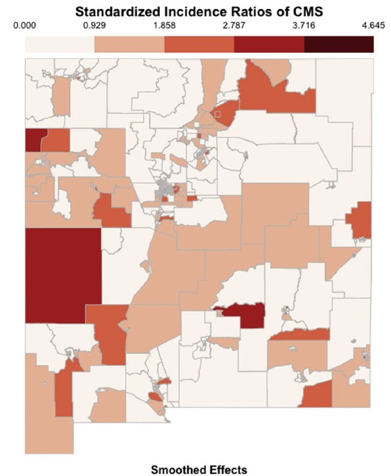

This study quantifies the spatiotemporal risk of child abuse and neglect in New Mexico at the census tract level over 9 years, identifies areas of increased risk, and evaluates the role of multiple measures of social and housing insecurity on substantiated child maltreatment referrals.

# Publication

## Variability and stability in child maltreatment risk across time and space

| | |
| ------------------| ------------------------------ |
| Short description: | This study analyzed substantiated child maltreatment risk in New Mexico from 2007 to 2015 using Bayesian spatial-temporal models at the census tract level. It found that neighborhood factors such as eviction rates, rent burden, urban location, food deserts, low income, lack of vehicle access, and disability prevalence increased maltreatment risk, while greater racial/ethnic diversity was linked to lower risk. The findings highlight the importance of addressing structural housing and social vulnerabilities in targeted child abuse prevention efforts, especially in economically and racially segregated neighborhoods. |
| Lead developer: | Barboza-Salerno |
| Further reading: | Please read the [paper](https://www-sciencedirect-com.proxy.lib.ohio-state.edu/science/article/pii/S0145213420301277) published in The International Journal of Child Abuse and Neglect |
| Download: | [<i class="fab fa-github"></i> Github repo]() |
| Main data source(s): | NM Data Collaborative; The Eviction Lab, USDA Department of Agriculture, Social Vulnerability Index |
| Coverage: | New Mexico | 
| Citation: | @article{barboza2020variability,   title={Variability and stability in child maltreatment risk across time and space and its association with neighborhood social \& housing vulnerability in New Mexico: A bayesian space-time model},   author={Barboza-Salerno, Gia Elise},   journal={Child Abuse \& Neglect},   volume={104},   pages={104472},   year={2020},   publisher={Elsevier} } |

Check out this [Access our tutorial on na here](/lab/markdown/spatialaccess.html) for more details.

