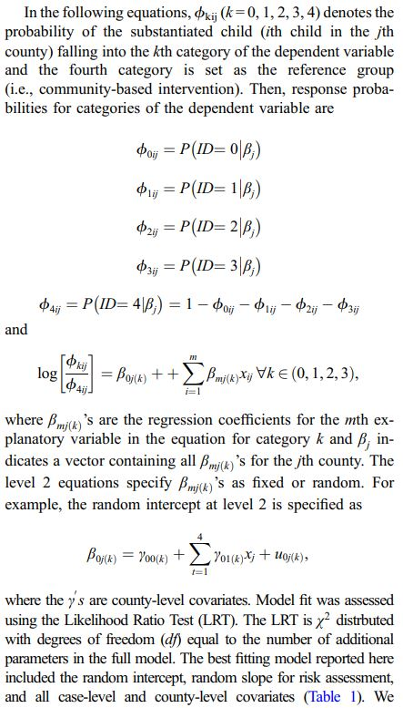
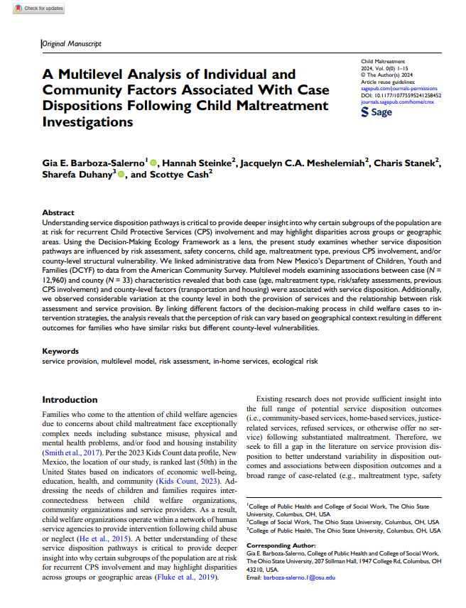

We are excited to announce our project [_A Multilevel Analysis of Individual and Community Factors Associated With Case Dispositions Following Child Maltreatment Investigations_](/project/multilevel-model-service-disposition/)!

We use multilevel multinomial logistic regression to examine variability in post-substantiation case dispositions.
This work is published in [article](https://doi.org/10.1177/10775595241258452) in the _Child Maltreatment_:

> Barboza-Salerno, G. E., Steinke, H., Meshelemiah, J. C., Stanek, C., Duhaney, S., & Cash, S. (2024). A Multilevel Analysis of Individual and Community Factors Associated With Case Dispositions Following Child Maltreatment Investigations. Child Maltreatment, 10775595241258452.
> [<i class="ai ai-doi-square ai"></i>10.1177/10775595241258452](https://doi.org/10.1177/10775595241258452) [<i class="far fa-file-pdf"></i> PDF](/project/multilevel-model-service-disposition/multilevel.pdf)</i>

The project was led by {}, and it was carried out in a large collaboration within our research group.

## Abstract

Understanding service disposition pathways is critical to provide deeper insight into why certain subgroups of the population are at risk for recurrent Child Protective Services (CPS) involvement and may highlight disparities across groups or geographic areas. Using the Decision-Making Ecology Framework as a lens, the present study examines whether service disposition pathways are influenced by risk assessment, safety concerns, child age, maltreatment type, previous CPS involvement, and/or county-level structural vulnerability. We linked administrative data from New Mexico’s Department of Children, Youth and Families (DCYF) to data from the American Community Survey. 
<br><br>Multilevel models examining associations between case ( N = 12,960) and county ( N = 33) characteristics revealed that both case (age, maltreatment type, risk/safety assessments, previous CPS involvement) and county-level factors (transportation and housing) were associated with service disposition. Additionally, we observed considerable variation at the county level in both the provision of services and the relationship between risk assessment and service provision. 
<br><br>By linking different factors of the decision-making process in child welfare cases to intervention strategies, the analysis reveals that the perception of risk can vary based on geographical context resulting in different outcomes for families who have similar risks but different county-level vulnerabilities.

## Highlights

+ Both individual- and county-level covariates significantly predicted referral outcomes.
+ County level variation in both the provision of services and the relationship between risk assessment and service provision.
+ The effect of risk assessment on referral outcomes should not differ by county, but it does for some referral outcomes.
+ Highlights the need for structured decision-making in child welfare investigations.
+ Uses multilevel modeling to examine risk assessment scores following a referral for child maltreatment.

[](/project/multilevel-model-service-disposition/)

### Paper 

For more information, download the  paper here

[](/publication/multilevel-model-service-disposition/)

BibTeX citation:
```bibtex
@article{barboza-salerno_multilevel_2024,
  title = {A Multilevel Analysis of Individual and Community Factors Associated With Case Dispositions Following Child Maltreatment Investigations},
  author = {Barboza-Salerno, Gia E. and Steinke, Hannah and Meshelemiah, Jacquelyn C.A. and Stanek, Charis and Duhany, Sharefa and Cash, Scottye},
  date = {2024-06-18},
  journaltitle = {Child Maltreatment},
  doi = {10.1177/10775595241258452},
  url = {https://journals.sagepub.com/doi/10.1177/10775595241258452},
}

}
```


