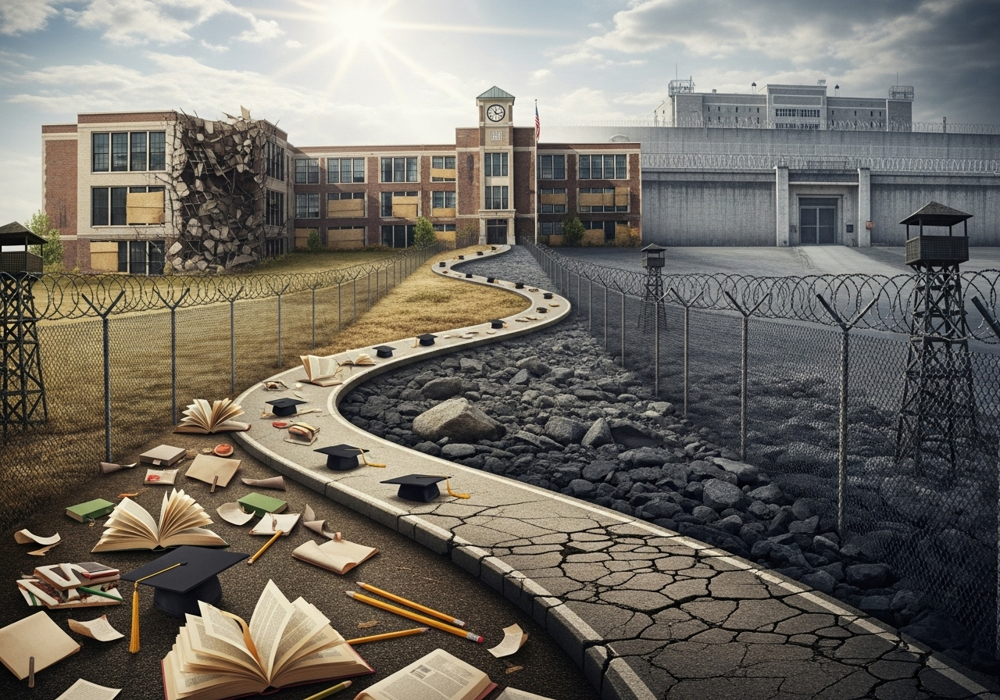

<section class="prose lg:prose-xl">
  

Our lab explores how educational outcomes are shaped by structural inequities, neighborhood conditions, and school-level practices such as exclusionary discipline. We focus on how factors like poverty, racial segregation, housing instability, and exposure to community violence influence student success. In addition, we study the built and social environments around schools—including traffic safety, crime, and access to supportive resources—to understand how place shapes learning opportunities.

<h2>Core Questions We Address</h2>
<ul>
  <li>How do patterns of school discipline vary across neighborhoods, schools, and demographic groups?</li>
  <li>What environmental and community-level factors (e.g., safety near schools, neighborhood resources, school climate) support or undermine educational outcomes?</li>
  <li>How can spatial and statistical models help identify schools and communities most at risk for inequitable outcomes?</li>
</ul>

<h2>Methods and Approaches</h2>

We use a mix of geospatial analysis, administrative data, and participatory research with educators, students, and community partners to inform evidence-based policy and practice. Our work often involves:

<ul>
  <li>Mapping disparities in school discipline and educational outcomes across districts and neighborhoods</li>
  <li>Linking school-level administrative data with neighborhood safety and built environment indicators</li>
  <li>Collaborating with schools, community organizations, and policymakers to design prevention and equity-focused interventions</li>
</ul>

<h2>Ongoing Projects</h2>

Current studies include analysis of disparities in school suspensions and expulsions, the relationship between neighborhood safety near schools and student outcomes, and evaluation of policy reforms aimed at reducing exclusionary discipline and promoting equitable educational opportunities.

</section>
