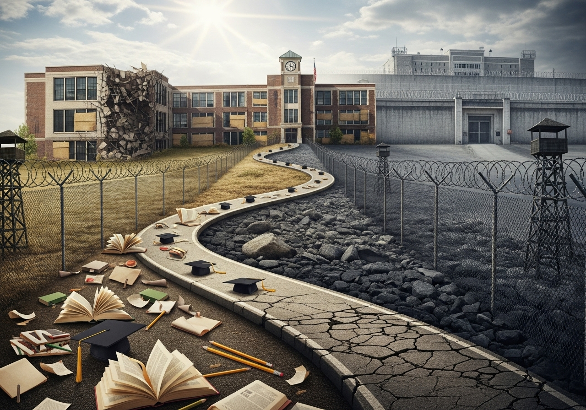

<section class="prose lg:prose-xl">
  

  
Our lab explores the profound connection between neighborhood safety and educational opportunity. A major focus of our work is the impact of <strong>gun violence on youth</strong>, as highlighted in our study <strong>"Gun Violence on Walkable Routes to and from School,"</strong> published in the <em>Journal of Urban Health</em>. We investigate how exposure to community violence and proximity to shooting incidents affects student attendance, achievement, and mental health. We move beyond the classroom to study how the broader built environment—including <strong>Safe Passages</strong> and neighborhood crime dynamics—shapes the learning experience.

  <h2>Core Questions We Address</h2>
  <ul>
    <li>How does exposure to <strong>neighborhood gun violence</strong> on routes to school impact academic performance and disciplinary outcomes?</li>
    <li>What are the spatial patterns of violence near schools, and how do they respond to policy changes like Safe Passage programs?</li>
    <li>How do structural inequities like exclusionary discipline and racial segregation interact with safe neighborhood conditions?</li>
  </ul>

  <h2>Methods and Approaches</h2>
  
We apply rigorous spatial and statistical techniques to understand the educational context:

  <ul>
    <li><strong>Acoustic Detection Sensors:</strong> Utilizing <strong>ShotSpotter</strong> data to capture precise, real-time incidents of gunfire that are often underreported in administrative crime data.</li>
    <li><strong>Spatial Accessibility Analysis:</strong> Modeling the density of gun violence along student travel routes to identify high-risk corridors.</li>
    <li><strong>Policy Evaluation:</strong> Assessing the effectiveness of <strong>Safe Passages</strong> interventions and reforms aimed at dismantling the school-to-prison pipeline.</li>
  </ul>

  <h2>Ongoing Projects</h2>
  
Current studies include a spatial analysis of gun violence density around K-12 schools, an evaluation of the relationship between <strong>school safety climates</strong> and student trauma responses, and research into policy reforms aimed at promoting equitable educational opportunities. Our work aims to create safer, more supportive environments where all youth can thrive.

  <h2>Key Publications & Resources</h2>
  <ul>
      <li><strong>Featured Study:</strong> <a href="">Spatial accessibility to gun violence exposure on walkable routes to and from school</a> (Journal of Urban Health).</li>
      <li><strong>Methodology:</strong> Utilizing acoustic detection sensors (ShotSpotter) for precise violence mapping.</li>
  </ul>
</section>
