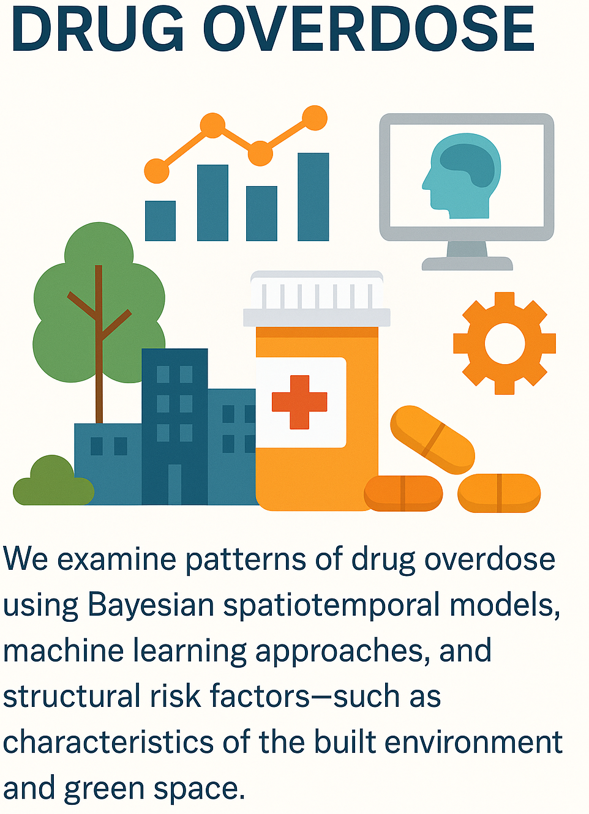

<section class="prose lg:prose-xl">
  

  
Our lab studies the intersection of substance use, <strong>overdose risk</strong>, and the built environment. We investigate how neighborhood conditions—including poverty, housing instability, and access to services—interact with social policies to shape the opioid crisis. Our work on the <strong>"Medicaid Expansion Project"</strong> highlights the role of policy environments in mitigating risk and supporting recovery. We examine the spatial variability in opioid-related drug overdoses to pinpoint communities in greatest need of intervention.

  <h2>Core Questions We Address</h2>
  <ul>
    <li>How do <strong>neighborhood conditions</strong> and built environment features influence local patterns of drug use and overdose?</li>
    <li>What is the impact of state and local <strong>policy environments</strong> (e.g., recovery housing initiatives) on treatment access and overdose mortality?</li>
    <li>How can <strong>Bayesian spatial models</strong> help target harm reduction resources to the communities most in need?</li>
  </ul>

  <h2>Methods and Approaches</h2>
  
We apply rigorous spatial and policy analysis to address the overdose crisis:

  <ul>
    <li><strong>Bayesian Spatiotemporal Analysis:</strong> Modeling the <strong>variability in opioid-related drug overdoses</strong> across space and time to identify emerging hotspots.</li>
    <li><strong>Policy Evaluation:</strong> Assessing the effectiveness of legislative interventions, such as those impacting <strong>recovery housing</strong>, on long-term treatment outcomes.</li>
    <li><strong>Community-Level Modeling:</strong> Understanding the dynamic relationship between neighborhood change and substance use trends.</li>
  </ul>

  <h2>Ongoing Projects</h2>
  
Our lab studies the intersection of substance use, overdose risk, and the built environment. We investigate how neighborhood conditions—including poverty, housing instability, and access to services—interact with social policies to shape the opioid crisis. Our work on the <strong>"Medicaid Expansion Project"</strong> highlights the role of policy environments in mitigating risk and supporting recovery. We examine the spatial variability in opioid-related drug overdoses to pinpoint communities in greatest need of intervention.

  <h2>Key Publications & Resources</h2>
  <ul>
      <li><strong>Current Grant:</strong> "Medicaid Expansion Project" (Principal Investigator).</li>
      <li><strong>Recent Research:</strong> <a href="https://doi.org/10.1016/j.sste.2024.100701" target="_blank">Employment industry and opioid overdose risk: A pre- and post-COVID-19 comparison</a> (Spatial and Spatiotemporal Epidemiology, 2024).</li>
      <li><strong>Methodology:</strong> Small Area Estimation Models for opioid misuse prevalence.</li>
  </ul>
</section>
