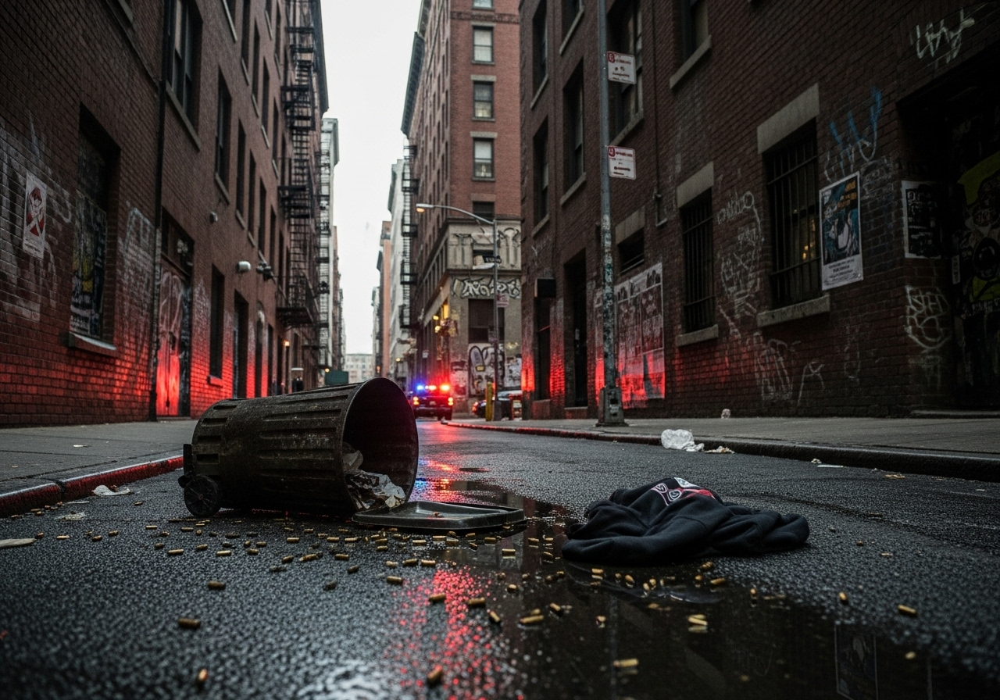

<section class="prose lg:prose-xl">
  

  
Our lab investigates how experiences of violence—including firearm injury, self-harm, and community trauma—are shaped by social, environmental, and spatial conditions. We examine how structural inequities such as housing instability, racial segregation, disinvestment, and systemic surveillance contribute to violence exposure and risk across the life course.

  <h2>Core Questions We Address</h2>
  <ul>
    <li>How are incidents of violence—including gun violence, suicide, and child fatality—distributed across neighborhoods and time?</li>
    <li>What structural and ecological conditions (e.g., heat, access to green space, poverty, service availability) intensify or buffer the risk of violence?</li>
    <li>How can spatial modeling and machine learning help us identify high-risk areas and intervene more effectively?</li>
  </ul>

  <h2>Methods and Approaches</h2>
  
We use a mix of geospatial data science, longitudinal modeling, and participatory research with community partners to develop evidence-informed policy recommendations and intervention strategies. Our work often involves:

  <ul>
    <li>Mapping and forecasting patterns of violence and self-harm at the neighborhood level</li>
    <li>Linking social, legal, and environmental data to understand spatial risk contexts</li>
    <li>Collaborating with schools, legal advocates, health providers, and public agencies</li>
  </ul>

  <h2>Ongoing Projects</h2>
  
Current studies explore the spatial and structural roots of firearm injury, suicide, and child deaths. We aim to identify intervention points through environmental design, public policy, legal advocacy, and system coordination to reduce harm and promote safety in marginalized communities.

  <h2>Current Projects:</h2>
  

    <a href="/lab/research/violence/webscraping/" class="text-blue-600 underline hover:text-blue-800">
      Webscraping and Automation Tools for Monitoring Child Fatality Trends
    </a>
  

</section>
