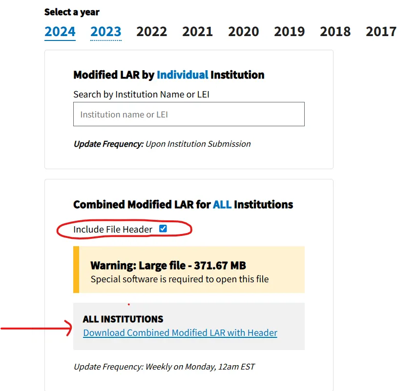
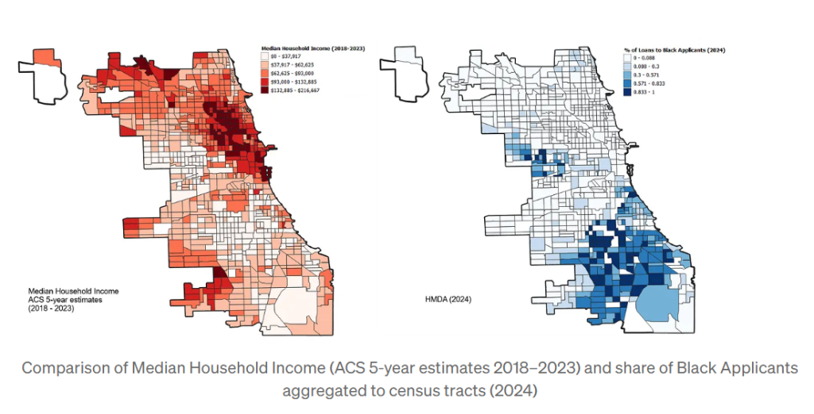

My lab recently published a paper examining the association between redlining, reinvestment, racial segregation, and firearm-related injury in Chicago, Illinois. You can read the paper here: [Redlining, reinvestment, and racial segregation: a Bayesian spatial analysis of mortgage lending trajectories and firearm-related violence](/publication/greenview/).

To develop reverse redlining measures, we relied on data from the Home Mortgage Disclosure Act (HMDA).

If you're interested in patterns of lending discrimination, the HMDA dataset is an invaluable resource. It contains millions of individual loan application records submitted annually by financial institutions, making it one of the most extensive and most detailed public data sources on mortgage lending in the United States. The 2024 nationwide Modified Loan/Application Register (LAR) alone contains over 12 million records and 85 fields that detail applicant and co-applicant demographics, loan terms, and property characteristics, including race, income, loan amount, interest rate, property value, and loan outcomes.

Each record includes the census tract (effectively a neighborhood) of the loan origination, which allows researchers to situate applicants within their geographic context. This spatial identifier can be linked to other data sources (e.g., Census or ACS data), enabling robust analyses of racial disparities in lending, neighborhood-level disinvestment, and broader patterns of residential inequality.

> I highly recommend the book titled "The Color of Law" by Richard Rothstein for anyone interested in understanding the deep-rooted history of discriminatory housing practices in the United States. The book compellingly explains how federal, state, and local policies — across multiple domains — intentionally created and reinforced de jure segregation. Chicago, which remains one of the most highly segregated urban areas in the country, is prominently featured.

## Why PostgreSQL?

Due to its sheer volume in both size and number of fields, the HMDA data is not well-suited for analysis using spreadsheets like Excel, particularly when analyzing multiple years or conducting joins. Instead, its relational structure lends itself to the use of a tool like PostgreSQL, an open-source relational database management system (RDBMS) that enables efficient querying, filtering, and aggregation of large datasets.

PostgreSQL is especially well-suited for the HMDA dataset because it can:

- Handle millions of rows
- Perform complex joins and filters
- Scale to support both interactive and batch analysis
- Support geospatial extensions like PostGIS for direct spatial querying and linking to geographic units such as census tracts or ZIP codes

If you don't already have it, [download PostgreSQL now](https://www.postgresql.org/download/).

## Motivation

My motivation for this analysis stems from a broader interest in how housing insecurity shapes health outcomes, consistent with a large body of research indicating that where you live significantly impacts your health. In my current work, I used HMDA data to create neighborhood typologies based on the race and income of applicants, and to generate measures of neighborhood change. While the process isn't particularly difficult, it also isn't obvious — hence this tutorial.

This walkthrough covers the complete process of downloading, inspecting, and importing the 2024 HMDA Modified LAR dataset into PostgreSQL using PowerShell and `psql`. It assumes you're using a Windows machine.

---

## Step 1: Download the Dataset

The dataset is freely available to the public. To download it follow these steps:

1. Navigate to <https://ffiec.cfpb.gov/data-publication/modified-lar/2024>
2. Choose:
   - **Year**: 2024
   - **Nationwide**: Combined file
3. Download the file: `2024_combined_mlar_header.txt`
4. Save or extract the file to: `C:\Users\YOUR_USER_NAME\Downloads\2024_combined_mlar_header\`



> Multiple years are available on the FFIEC website. You can download historical data to examine lending trends over time.

---

## Step 2: Confirm the File Structure in PowerShell

The file structure of the HMDA dataset is not typical for most users or applications. It is a pipe-delimited text file (`.txt`), which can make it difficult to read or interpret using standard spreadsheet tools like Excel. The data appears in a long, unformatted stream, separated by vertical bars (`|`), and without intuitive formatting.

To extract the necessary information and prepare the data for import into PostgreSQL, I recommend using Windows PowerShell to inspect the file structure first. This allows you to confirm key details such as the number of fields (columns), the presence of a header row, and the overall formatting of the data.

Open PowerShell and run the following:

```powershell
cd "C:\Users\YOUR_USER_NAME\Downloads\2024_combined_mlar_header"

# View the header (column names)
Get-Content .\2024_combined_mlar_header.txt -TotalCount 1

# Count the number of columns (should be 85)
((Get-Content .\2024_combined_mlar_header.txt -TotalCount 1) -split '\|').Count
```

---

## Step 3: Create the PostgreSQL Table

To create a table called `lar2024` in PostgreSQL using SQL, begin by launching your SQL interface. If you're using a graphical tool like pgAdmin, open the Query Tool by right-clicking on your database and selecting "Query Tool." If you're using the psql command-line interface, connect to your target database like this:

```bash
psql -U your_username -d your_database_name
```

Replace the placeholders with your actual credentials.

Once you're connected to your PostgreSQL database, you'll use a `CREATE TABLE` SQL statement to define the structure of the `lar2024` table:

```sql
DROP TABLE IF EXISTS lar2024;
CREATE TABLE lar2024 (
    activity_year INTEGER,
    lei TEXT,
    loan_type INTEGER,
    loan_purpose INTEGER,
    preapproval INTEGER,
    construction_method INTEGER,
    occupancy_type INTEGER,
    loan_amount BIGINT,
    action_taken INTEGER,
    state_code TEXT,
    county_code TEXT,
    census_tract TEXT,
    applicant_ethnicity_1 INTEGER,
    applicant_ethnicity_2 TEXT,
    applicant_ethnicity_3 TEXT,
    applicant_ethnicity_4 TEXT,
    applicant_ethnicity_5 TEXT,
    co_applicant_ethnicity_1 INTEGER,
    co_applicant_ethnicity_2 TEXT,
    co_applicant_ethnicity_3 TEXT,
    co_applicant_ethnicity_4 TEXT,
    co_applicant_ethnicity_5 TEXT,
    applicant_ethnicity_observed INTEGER,
    co_applicant_ethnicity_observed INTEGER,
    applicant_race_1 INTEGER,
    applicant_race_2 TEXT,
    applicant_race_3 TEXT,
    applicant_race_4 TEXT,
    applicant_race_5 TEXT,
    co_applicant_race_1 INTEGER,
    co_applicant_race_2 TEXT,
    co_applicant_race_3 TEXT,
    co_applicant_race_4 TEXT,
    co_applicant_race_5 TEXT,
    applicant_race_observed INTEGER,
    co_applicant_race_observed INTEGER,
    applicant_sex INTEGER,
    co_applicant_sex INTEGER,
    applicant_sex_observed INTEGER,
    co_applicant_sex_observed INTEGER,
    applicant_age TEXT,
    applicant_age_above_62 TEXT,
    co_applicant_age TEXT,
    co_applicant_age_above_62 TEXT,
    income TEXT,
    purchaser_type INTEGER,
    rate_spread TEXT,
    hoepa_status INTEGER,
    lien_status INTEGER,
    applicant_credit_scoring_model INTEGER,
    co_applicant_credit_scoring_model INTEGER,
    denial_reason_1 TEXT,
    denial_reason_2 TEXT,
    denial_reason_3 TEXT,
    denial_reason_4 TEXT,
    total_loan_costs TEXT,
    total_points_and_fees TEXT,
    origination_charges TEXT,
    discount_points TEXT,
    lender_credits TEXT,
    interest_rate TEXT,
    prepayment_penalty_term TEXT,
    debt_to_income_ratio TEXT,
    combined_loan_to_value_ratio TEXT,
    loan_term TEXT,
    intro_rate_period TEXT,
    balloon_payment INTEGER,
    interest_only_payment INTEGER,
    negative_amortization INTEGER,
    other_non_amortizing_features INTEGER,
    property_value TEXT,
    manufactured_home_secured_property_type INTEGER,
    manufactured_home_land_property_interest INTEGER,
    total_units TEXT,
    multifamily_affordable_units TEXT,
    submission_of_application INTEGER,
    initially_payable_to_institution INTEGER,
    aus_1 INTEGER,
    aus_2 TEXT,
    aus_3 TEXT,
    aus_4 TEXT,
    aus_5 TEXT,
    reverse_mortgage INTEGER,
    open_end_line_of_credit INTEGER,
    business_or_commercial_purpose INTEGER
);
```

---

## Step 4: Import the Data

Now that the table structure is created, you can import the data. I prefer using the command-line interface, which is called `psql` in PostgreSQL, to import the data.

In `psql`, use the following single-line import command:

```sql
\copy lar2024 FROM 'C:/Users/YOUR-USER-NAME/Downloads/2024_combined_mlar_header/2024_combined_mlar_header.txt' WITH (FORMAT csv, DELIMITER '|', HEADER true, NULL '');
```

This tells PostgreSQL to:

- Read a pipe-delimited file
- Use the header row to match columns
- Treat empty strings as `NULL`

> This must be entered as a single line. You will get a notification that the data were successfully imported.

---

## Step 5: Verify the Import

I always like to verify that what I am doing is correct. To verify the number of rows expected after importing the 2024 HMDA Modified Loan/Application Register (LAR) data into PostgreSQL, I consulted the official HMDA data publication website maintained by the Consumer Financial Protection Bureau (CFPB).

After importing the file using the `\copy` command in `psql`, run a simple SQL query to verify the total number of records successfully loaded:

```sql
SELECT COUNT(*) FROM lar2024;
SELECT * FROM lar2024 LIMIT 5;
```

**Expected row count for the whole nation**: ~12 million.

---

## Create the Chicago, Illinois, Subset

I want my analysis to focus on a specific subset of the data (e.g., applicant race, loan originals that are single-family homes, etc., for Chicago). I can now create a sub-query containing a smaller subset of the data, export it to a `.csv` file, and then import it into `R` or `QGIS`.

The simple query I used to select the columns and filter the data to Cook County (which contains Chicago) is shown below:

```sql
DROP TABLE IF EXISTS public.il2024f1;
CREATE TABLE public.il2024f1 AS
SELECT 
    l.activity_year, 
    l.state_code,
    l.county_code,
    l.census_tract,
    l.debt_to_income_ratio,
    l.combined_loan_to_value_ratio, 
    l.income,
    l.property_value, 
    l.loan_amount,
    l.interest_rate,
    l.applicant_ethnicity_1, 
    l.applicant_race_1,
    l.denial_reason_1,
    l.rate_spread,
    l.hoepa_status,
    l.lien_status
FROM public.lar2024 l
WHERE 
    l.loan_purpose = '1'
    AND l.action_taken = '1'
    AND l.loan_type = '1'
    AND l.occupancy_type = '1'
    AND l.state_code = 'IL'
    AND l.county_code = '17031'
    -- Only accept property values that are purely numeric
    AND l.property_value ~ '^[0-9]+$'
    AND l.income ~ '^[0-9]+$'
    AND l.loan_amount IS NOT NULL
    AND l.loan_amount <> 99999
    -- Equivalent to derived_dwelling_category = 'Single Family'
    AND l.construction_method = '1'
    AND l.total_units IN ('1', '2', '3', '4', '')
;
```

This query selects conventional, owner-occupied, site-built single-family loans in Cook County, Illinois, excluding missing or exempt values.

---

## Prepare File for Additional Analysis

However, we first need to prepare the file for further analysis. I will leave that to you since you can now do this easily in Excel, etc. Below, I divided the number of Black applicants in each census tract by the total number of applicants in that tract to get the share of Black applicants. I also downloaded Median Income data using the `tidycensus` package in R. This allows us to compare the average median household income 5-year estimates with the share of Black applicants receiving a loan in each neighborhood.



Do you observe any patterns? I do.

---

## Conclusion

The HMDA dataset offers an unparalleled opportunity to examine lending patterns, racial disparities, and neighborhood-level investment across the United States. By importing the 2024 Modified LAR data into PostgreSQL, researchers can efficiently manage, filter, and analyze millions of loan records while linking them to geographic and demographic data.

### Next Steps

- Join with Census shapefiles to visualize by tract
- Summarize by loan purpose, race, or geography
- Export to PostGIS for spatial queries

**Happy Coding!**

---

## Related Resources

- [HMDA Data Publication](https://ffiec.cfpb.gov/data-publication/)
- [PostgreSQL Documentation](https://www.postgresql.org/docs/)
- [PostGIS Spatial Extension](https://postgis.net/)
- [Our GitHub Repository](https://github.com/issues-osu)
